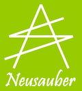

.. _h174fb648377959437b5c1f697c1c40:

關於意杰
********

\ |IMG1|\ 

.. _h616e164e5113231d257065146d365257:

意杰國際 — 防鏽科技專業研發abv
==============================

本公司為一專業的化學研發公司，致力於表面處理劑的研發與應用。產品應用領域涵蓋金屬、玻璃、陶瓷材料等製品。

全世界每年因為金屬生鏽及髒污造成的直接經濟損失高達7000億美元以上。 很多在您生活上出現的物品，本來有著美麗的面貌，只是蒙塵了，鏽蝕了。本公司的產品要幫那些我們日常生活的物品恢復原有的美麗，經常保持著明亮與乾淨的感覺，帶給您充滿質感的生活環境。

本公司全員努力的目標是提供您可以安心使用的產品，為您提供一系列透明功能性薄膜產品， 幫助您替家人打造健康與美麗的生活環境。 所有產品皆符合 RoHS 電子級綠色產品規範，不含揮發性有機化合物(VOCs)與雙酚A，不含八大重金屬，膜層符合FDA規範，您可安心使用。

+--------+----------------------------------------+
|聯絡人  |葉瀗元                                  |
+--------+----------------------------------------+
|FB粉絲團|\ |LINK1|\                              |
+--------+----------------------------------------+
|EMAIL   |service@neusauber.com                   |
+--------+----------------------------------------+
|電話    |03-3659119                              |
+--------+----------------------------------------+
|地址    |桃園市桃園區同德里同德五街218號1樓      |
+--------+----------------------------------------+
|統一編號|53599809                                |
+--------+----------------------------------------+
|匯款帳號|渣打銀行 八德分行 （匯款代碼：052-0214）|
+--------+----------------------------------------+
|        |戶名: 意杰國際有限公司                  |
+--------+----------------------------------------+
|        |帳號: 02-953-000-626-980                |
+--------+----------------------------------------+

.. bottom of content

.. |LINK1| raw:: html

    <a href="https://www.facebook.com/neusauber" target="_blank">https://www.facebook.com/neusauber</a>

