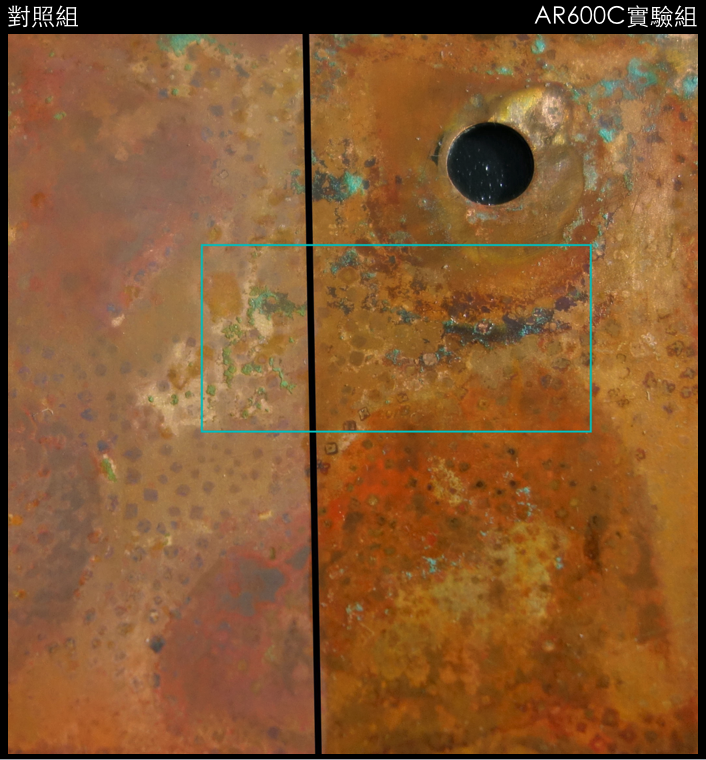

.. _h50234273224b622946134f4669158:

AR600C透明防鏽劑防止銅鏽增生測試
********************************

.. _hd1b83d48586e1b393a624e28544946:

基材：
======

紅銅片

.. _h35555a256c51692623704c7f4b436561:

試片製做:
=========

以醋酸、氯化鈉、氯化銅、氨水之水溶液舊化24小時，乾燥24小時，擦去表面無附著之銅綠。將AR600C透明防鏽劑塗敷於試片右側，靜置乾燥4小時後，再塗佈AR 600C一次，靜置4小時。

.. _h35555a256c51692623704c7f4b436561:

增生方式:
=========

於表面噴灑自來水，置放8小時，環境溫度24-26℃，相對濕度55-65%。

.. _h35555a256c51692623704c7f4b436561:

測試結果:
=========

經自來水噴灑靜置後，AR600C保護之右側區域並無明顯外觀變化。未保護左側區域明顯變色產生水漬腐蝕花紋，銅鏽顏色變鮮豔，有新鏽產生。

\ |IMG1|\ 

圖一：噴水靜置前。

\ |IMG2|\ 

圖二：噴水靜置8小時後

\ |IMG3|\ 

圖三：放大圖一、圖二框起處。上，噴水靜置前；下，噴水靜置8小時後。檢視AR600C保護區域並無新生銅鏽，未保護處銅綠更明顯高度也增加，顯示有新生之銅鏽產生。

.. bottom of content

