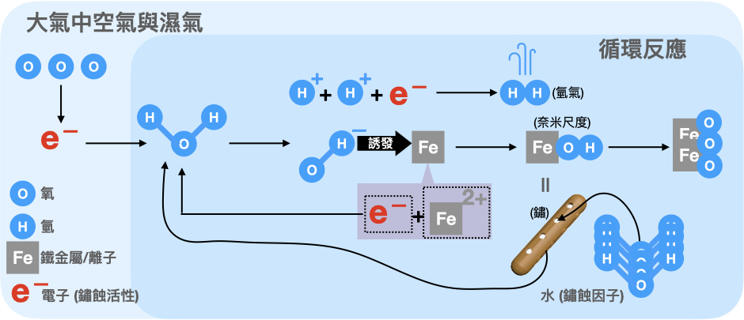
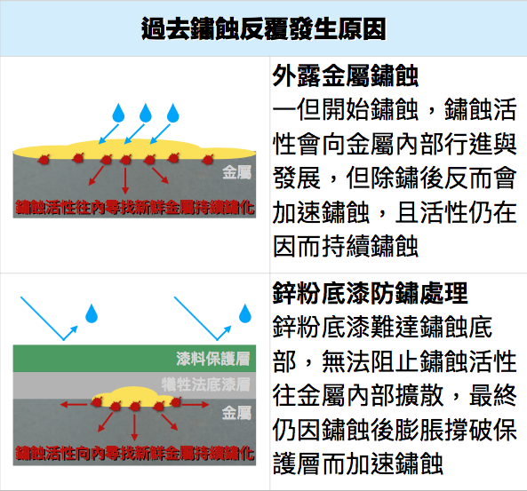

.. _h56a41143b2a3f40427e7a356617232:

金屬如何生鏽?過去如何除鏽與防鏽?
********************************

\ |STYLE0|\ 

”生鏽“的過程是當水氣與空氣接觸金屬後，會產生電池效應也就是鏽蝕反應（如下圖），電池效應會產生腐蝕電流，即為啟動鏽蝕反應，生成三氧化二鐵及結晶水，就是我們看到的鐵鏽。若水或濕氣中含有硫化氫、或鹽分會提高腐蝕電流，鏽蝕反應將加速進行。如果金屬本身的溫度比大氣溫度每高10度，鏽蝕反應的速度就會增加2倍。

\ |IMG1|\ 

因為金屬從被製造出來的那一刻就開始生鏽，有些人會在這裡誤解防鏽基本觀念，即使生鏽了，只要隔絕空氣、水氣，就不會再生鏽。不！以鐵為例，即使沒有空氣，只要含有腐蝕電流與三氧化二鐵及結晶水（鐵鏽），有鏽蝕的動力及水，就會繼續鏽蝕，生成物變成含結晶水之二氧化二鐵與氫氣，壓力累積後鏽蝕最終仍會破繭而出（如下圖）。

\ |IMG2|\ 

所以為了要去除腐蝕電流與鐵鏽，在工廠裡就常會用酸洗等化學方法，消除腐蝕電流與鐵鏽，再用電鍍、塗裝、含浸等技術隔絕空氣與水氣，達到防鏽的目的。

\ |STYLE1|\ 

鏽蝕之後常用的防鏽整新工法，是先把表面完全除去鐵鏽，然後上止鏽漆消除再起的腐蝕電流，最後塗上油漆隔絕空氣、水氣。

但是要把表面的鐵鏽與腐蝕電流完全去除就是一件極難達成的工作。

\ |STYLE2|\ 不但是非常麻煩與辛苦的工序，更是造成反效果的元兇。小區域常用人工或機械研磨除鏽，大範圍多用超高壓水刀或噴砂來處理。

採用機械\ |STYLE3|\ ，雖可快速去除鏽蝕但伴隨著高熱產生，在降溫過程中會與空氣中的濕氣進行熱交換，反而會令裸露的金屬快速鏽蝕。

\ |STYLE4|\ 除鏽，可快速除去厚重鏽蝕層，但也讓裸露的金屬暴露在大量的水裡，鏽蝕當然也很快地出現。

\ |STYLE5|\ 除鏽，可將鏽蝕去除非常乾淨，然而表面會有應力殘留（能量殘留）與尖銳粗化的表面，使金屬更容易與濕氣發生鏽蝕反應。

\ |STYLE6|\ 

消除腐蝕電流多利用與容易產生氧化反應的金屬離子相結合達到停止反應的目的，例如常見的紅丹漆或鋅粉漆，塗布在除完鏽的金屬表面，引導腐蝕電流往紅丹漆或鋅粉漆的方向流動，然而實際情況是腐蝕電流受到鏽的阻隔反往金屬內部流竄，令紅丹漆與鋅粉漆完全無用武之地，因此常見鋅粉層仍完好，但鏽蝕卻沿著鋅粉與金屬間的介面全面擴散（如下圖）。

\ |IMG3|\ 

..  Note:: 

    推薦閱讀：最新不用除鏽就可防鏽的方法，\ |LINK1|\ 

.. bottom of content

.. |STYLE0| replace:: **金屬從被製造出來的那一刻就開始生鏽！！**

.. |STYLE1| replace:: **出廠之後的鏽蝕怎麼辦呢？**

.. |STYLE2| replace:: **除鏽**

.. |STYLE3| replace:: **研磨**

.. |STYLE4| replace:: **超高壓水刀**

.. |STYLE5| replace:: **噴砂**

.. |STYLE6| replace:: *所以除鏽完成的當下，也是鏽蝕重生的時刻。*

.. |LINK1| raw:: html

    <a href="http://tw.neusauber.com" target="_blank">AR透明防鏽劑的介紹</a>

.. |IMG2| image:: static/金屬如何生鏽_2.png
   :height: 361 px
   :width: 525 px

