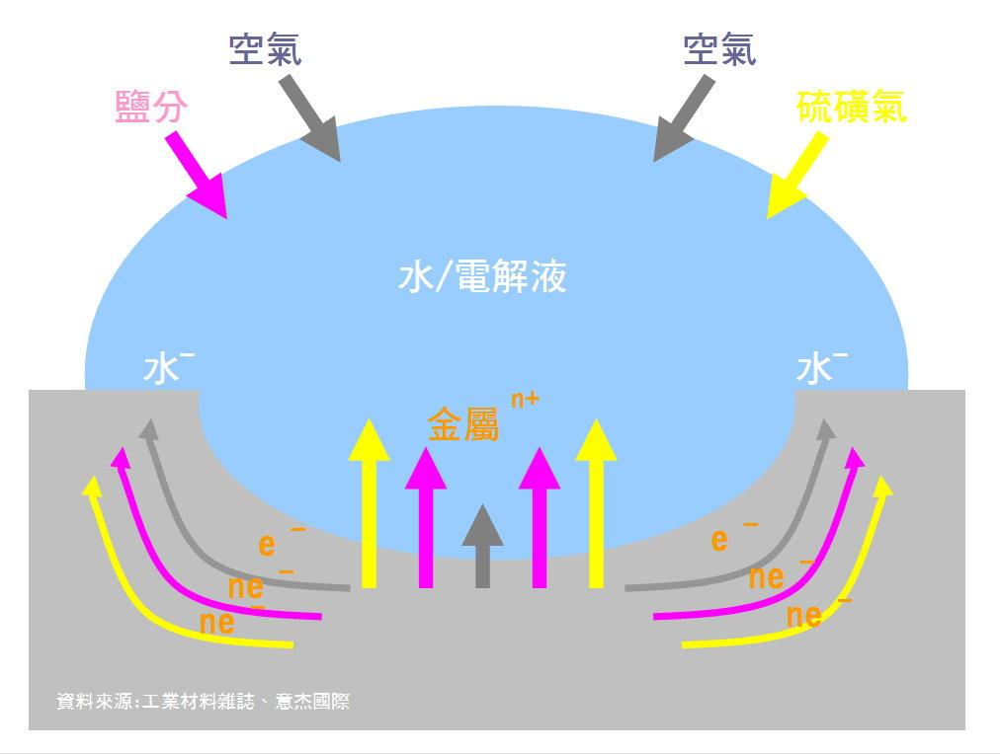

.. _h56a41143b2a3f40427e7a356617232:

金屬如何生鏽?過去如何除鏽與防鏽?
********************************

只要有水、有空氣金屬就會生鏽。如果再加上海邊鹽分、或溫泉酸氣，會產生電池效應，生鏽的速度就快到無法想像。

如圖所示，當水與空氣接觸金屬，鏽蝕反應啟動後，即開始產生腐蝕電流，若水中有硫磺氣、或鹽分進入，鏽蝕反應將加速進行，腐蝕電流大增，鏽蝕更快速、嚴重。即使之後無水，鏽蝕反應之腐蝕電流依然會持續進行與產生，若無適當之止鏽或除鏽，即使已塗漆、或其他隔絕水、空氣作法，鏽蝕反應不斷在內部發生，最後膨脹的鏽片會從內部向外爆開，造成更嚴重影響。

\ |IMG1|\ 

最簡單的防鏽作法，就是在金屬生鏽氧化前用能隔絕空氣與水氣的東西把金屬包起來。

.. _hd7b751276e3b5a272340277219674:

不止鏽或除鏽會如何?
===================

金屬鏽蝕就像電池放電一樣，需要消耗金屬來產生電流，不止鏽或除鏽，最終完好的金屬被消耗殆盡，失去原有金屬的結構能力，造成斷裂、破損，外觀也變成噁心不堪，鏽片更轉成空氣粉塵污染環境，影響健康。最終仍須更換新品，造成更大經濟損失。

.. _h5c462122702e7cc06763134049d56:

現行止鏽或除鏽方法
==================

.. _h1634483c7822441972316c7301545:

止鏽
----

.. _h2c1d74277104e41780968148427e:

.. _h174fb648377959437b5c1f697c1c40:

鏽蝕轉化
~~~~~~~~

    以高濃度酸及有機鹵化物，對鏽片進行化學反應，使其轉化為更安定不反應之金屬氧化物膜層，並附著於原本金屬上，保護金屬自身不受外界水、空氣影響。

    ``優點``

    不需除鏽，快速止鏽形成保護膜，可當底漆使用。

    ``缺點``

    只能於鏽蝕後使用，金屬表面已受鏽蝕影響。深黑色膜層，外觀不佳，且仍具親水性，需再上漆才能有較好之防鏽保護，但一段時間後受轉化的金屬氧化物膜層會與原金屬產生膨脹剝離，形成空隙讓空氣與水進入，造成更嚴重的鏽蝕。

.. _h1634483c7822441972316c7301545:

除鏽
----

--------

.. _h174fb648377959437b5c1f697c1c40:

物理除鏽
~~~~~~~~

以噴砂、或磨料除去鏽化表層。

    ``優點``

    快速去除鏽化層。

    ``缺點``

    原金屬尺寸被嚴重破壞。露出之金屬表層，需快速立即予以適當保護，否則將更容易生鏽。除鏽時造成大量粉塵，傷害嚴重人體與環境。

以超高壓水刀除去鏽化表層。

    ``優點``

    快速去除鏽化層，環保。

    ``缺點``

    除去鏽蝕的金屬裸露在充滿水的環境下，將快速產生鏽蝕。超高壓水刀具有工安疑慮。

.. _h174fb648377959437b5c1f697c1c40:

化學除鏽
~~~~~~~~

    以可溶鏽之酸液溶解鏽化層。

    ``優點``

    可維持原金屬尺寸與外觀。

    ``缺點``

    僅少量鏽斑時使用，大量鏽蝕時無明顯效果。除鏽後金屬表面酸液須用水清洗，造成環境污染。清洗水與殘酸若未處理完全，會是金屬再度鏽蝕的潛在風險。鏽斑去除後，仍需上漆或上油保護。

.. _h1634483c7822441972316c7301545:

防鏽
----

--------

.. _h1634483c7822441972316c7301545:

上油
~~~~

    油脂可快速隔絕空氣、排除水分、並具潤滑效果

    ``優點``

    快速隔絕空氣、排除水份達到防鏽效果、具潤滑效果

    ``缺點``

    效果不持久、油脂污染、容易沾附灰塵、味道不佳

.. _h174fb648377959437b5c1f697c1c40:

上紅丹漆
~~~~~~~~

    金屬鏽蝕後釋放鉛離子鈍化活性金屬達到防鏽效果

    ``優點``

    效果較一般塗料持久，可當底漆使用。價格低。

    ``缺點``

    含鉛對人體有嚴重不可逆的影響。使用前需除鏽或止鏽。外觀顏色突兀。

.. _h174fb648377959437b5c1f697c1c40:

上鋅粉漆
~~~~~~~~

    面對造成鏽蝕的空氣、水、鹽分、硫(酸)氣等因子，以漆內所含之鋅粉與其先結合，消除鏽蝕因子與被保護金屬結合的機會。

    ``優點``

    效果較持久。

    ``缺點``

    顏色與原金屬基材不同。使用前需除鏽或止鏽。價格高。

推薦閱讀：最新不用除鏽就可防鏽的方法，\ |LINK1|\ 

.. bottom of content

.. |LINK1| raw:: html

    <a href="http://tw.neusauber.com" target="_blank">AR透明防鏽劑的介紹</a>

