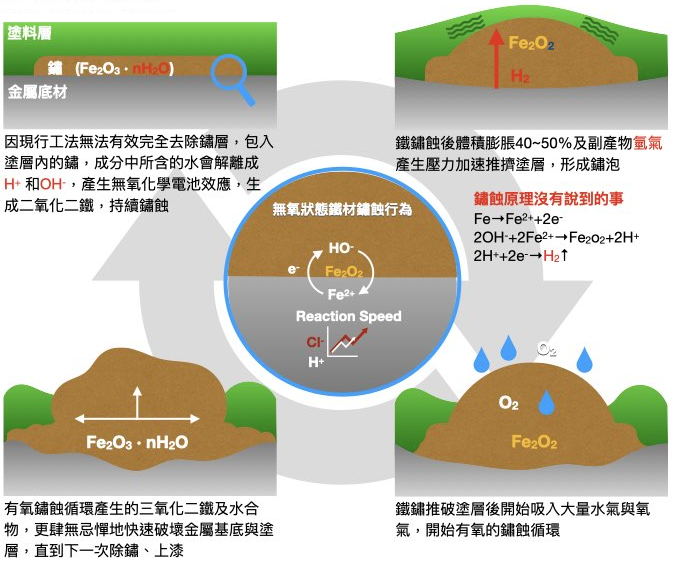

.. _h56a41143b2a3f40427e7a356617232:

金屬如何生鏽?過去如何除鏽與防鏽?
********************************

金屬從被製造出來的那一刻就開始生鏽！！

”生鏽“的過程是當水氣與空氣接觸金屬後，會產生電池效應也就是鏽蝕反應（如下圖），電池效應會產生腐蝕電流，即為啟動鏽蝕反應，生成三氧化二鐵及結晶水，就是我們看到的鐵鏽。若水或濕氣中含有硫化氫、或鹽分會提高腐蝕電流，鏽蝕反應將加速進行。如果金屬本身的溫度比大氣溫度每高10度，鏽蝕反應的速度就會增加2倍。

\ |IMG1|\ 

因為\ |STYLE0|\ ，有些人會在這裡誤解防鏽基本觀念，即使生鏽了，只要隔絕空氣、水氣，就不會再生鏽。不！以鐵為例，即使沒有空氣，只要含有腐蝕電流與三氧化二鐵及結晶水（鐵鏽），有鏽蝕的動力及水，就會繼續鏽蝕，生成物變成二氧化二鐵及結晶水，鏽蝕最終仍會破繭而出（如下圖）。

\ |IMG2|\ 

所以為了要去除腐蝕電流與鐵鏽，在工廠裡就常會用酸洗等化學方法，消除腐蝕電流與鐵鏽，再用電鍍、塗裝、含浸等技術隔絕空氣與水氣，達到防鏽的目的。

金屬物品出廠之後的鏽蝕呢？

推薦閱讀：最新不用除鏽就可防鏽的方法，\ |LINK1|\ 

.. bottom of content

.. |STYLE0| replace:: *金屬從被製造出來的那一刻就開始生鏽*

.. |LINK1| raw:: html

    <a href="http://tw.neusauber.com" target="_blank">AR透明防鏽劑的介紹</a>

.. |IMG1| image:: static/金屬如何生鏽_1.jpeg
   :height: 249 px
   :width: 330 px

