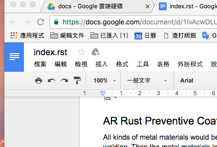

.. _h182f521a41561a52521e2255602c70:

AR Transparent Rust Inhibitor
#############################

.. toctree:: 
    :maxdepth: 2
    :hidden:

    
    products
    documents
    about
    buy

|REPLACE1|

.. _h2c1d74277104e41780968148427e:

|REPLACE2|

AR Transparent Rust Inhibitor is solvent base chemical agent, providing anti rust thin transparent protective film for covered surface. Wide range of applications, for example, new or rusted metal frame. It can make new material surface survived over 20 months without any weight loss in ISO 9223 C5 corrosive environment. Also improve D grade (by Swedish Standard SIS-05-5900) rusted parts to A grade immediately, and stay the same over 6 months in C5 corrosive environment.

Rohs, VOCs, FDA verificated by SGS

.. _h2c1d74277104e41780968148427e:

|REPLACE3|

    ARPrimer Transparent Rust Inhibitor is solvent base chemical agent, providing metal/rust conversion substrate for adhesive with paints. Suit for wide range of paint system ex. Epoxy, PU, PET. Treat then Paint system make user shorten working time, with no waiting ARPrimer cured can paint directly.All kinds of metal or rust surface can be treated with ARPrimer Transparent Rust Inhibitor and paint to against/stop rust or corrosion.

    Rohs, VOCs, FDA verificated by SGS

|REPLACE4|

.. bottom of content

.. |REPLACE1| raw:: html

    
.. |REPLACE2| raw:: html

    <table cellspacing="0" cellpadding="0" style="width:100%">
    <tbody>
    <tr><td style="vertical-align:Top;padding-top:5px;padding-bottom:5px;padding-left:5px;padding-right:5px;border:solid 1px #000000">
AR Transparent Rust Inhibitor
<ul style="list-style:disc;list-style-image:inherit;padding:0px 40px;margin:initial"><li style="list-style:inherit;list-style-image:inherit">Totally Anti rust</li><li style="list-style:inherit;list-style-image:inherit">Quickly Stop rust reaction</li><li style="list-style:inherit;list-style-image:inherit">Easy Treats without remove rusted layer</li><li style="list-style:inherit;list-style-image:inherit">Thin transparency protect film</li><li style="list-style:inherit;list-style-image:inherit">Multiple apply method</li><li style="list-style:inherit;list-style-image:inherit">Saving cost</li></ul></td><td style="vertical-align:Top;padding-top:5px;padding-bottom:5px;padding-left:5px;padding-right:5px;border:solid 1px #000000">

</td></tr>
    </tbody></table>

.. |REPLACE3| raw:: html

    <table cellspacing="0" cellpadding="0" style="width:100%">
    <tbody>
    <tr><td style="vertical-align:Top;padding-top:5px;padding-bottom:5px;padding-left:5px;padding-right:5px;border:solid 1px #000000">
ARPrimer Transparent Rust Inhibitor
<ul style="list-style:disc;list-style-image:inherit;padding:0px 40px;margin:initial"><li style="list-style:inherit;list-style-image:inherit">Totally anti rust</li><li style="list-style:inherit;list-style-image:inherit">Quickly stop rust reaction</li><li style="list-style:inherit;list-style-image:inherit">Easy treats without remove rusted layer</li><li style="list-style:inherit;list-style-image:inherit">Thin transparency protect film</li><li style="list-style:inherit;list-style-image:inherit">Multiple apply method</li><li style="list-style:inherit;list-style-image:inherit">Suite for all kinds of paints</li><li style="list-style:inherit;list-style-image:inherit">Treat then Paint system</li><li style="list-style:inherit;list-style-image:inherit">Saving time and cost</li></ul></td><td style="vertical-align:Top;padding-top:5px;padding-bottom:5px;padding-left:5px;padding-right:5px;border:solid 1px #000000">

</td></tr>
    </tbody></table>

.. |REPLACE4| raw:: html

    

