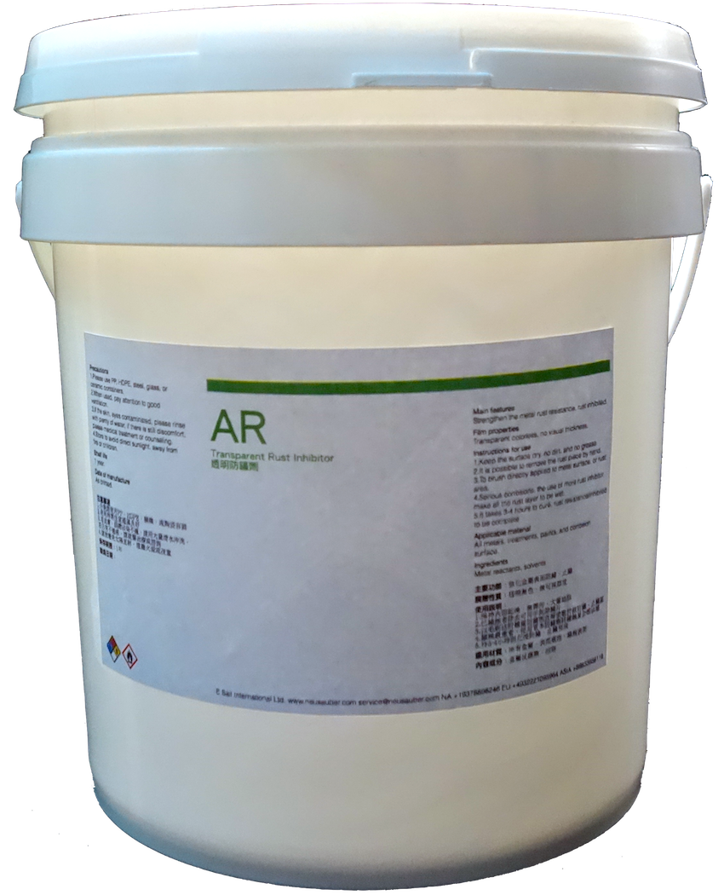

.. _hd7b751276e3b5a272340277219674:

啟動防鏽保養的新時代
####################

.. toctree:: 
    :maxdepth: 2
    :hidden:

    about
    products
    buy
    videos
    documents
    photoswall
    blogs/ar600intro
    blogs/AR600CAntiCopper
    blogs/AR600DM02
    blogs/howcrust
    blogs/whyrust
    projects/overtimepaycal

.. _h7c3f275a36264d7b12797d7a6f2a3d43:

意杰國際AR系列防鏽保養劑
************************

金屬材料在運送、組立、螺絲鎖附、焊接後,表面原有的防鏽處理因受力、高溫熔融的破壞而失效,即使是白鐵或是不鏽鋼材質也一樣都會有快速生鏽或鏽水問題。AR 600透明防鏽劑為金屬表面防鏽處理劑,利用產生透明膜層的方式強化金屬表面的防鏽保護,以排除溼氣的方式減少氧化作用。經過AR 透明防鏽劑的處理之後,可達96小時鹽霧試驗,可將金屬原有的防鏽能力提昇5~10倍。

.. _h1b1749b524f4a6268443828283c1b3b:

AR Rust Preventive Coating Series
=================================

All kinds of metal materials would be damaged on surface after transportation, construction, screwing and welding. Then the metal materials lose its capability to prevent from rust. Rust would quickly be overwhelming on hurting spots no matter it is galvanized iron (G.I.) or stainless steel. The rust would accidentally destroy the credits of your brands. The AR series would help your product to be protected from annoying rust.

\ |IMG1|\ 

.. bottom of content

