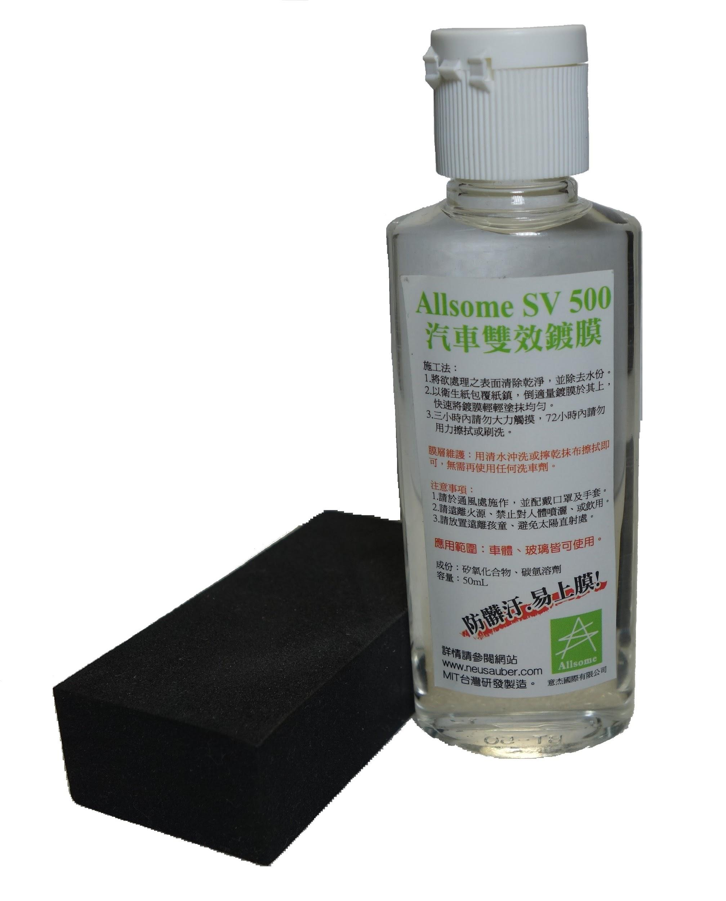
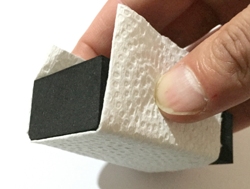

.. _h163a195d1b577d6e183a4f6151466e1a:

Allsome SV500 汽車雙效鍍膜

***************************

|REPLACE1|

.. _h2c1d74277104e41780968148427e:

|REPLACE2|

|REPLACE3|

|REPLACE4|

.. _h2c1d74277104e41780968148427e:

|REPLACE5|

|REPLACE6|

|REPLACE7|

.. _h2c1d74277104e41780968148427e:

|REPLACE8|

|REPLACE9|

.. _h2c1d74277104e41780968148427e:

|REPLACE10|

.. bottom of content

.. |REPLACE1| raw:: html

    
.. |REPLACE2| raw:: html

    <table cellspacing="0" cellpadding="0" style="width:100%">
    <tbody>
    <tr><td style="width:61%;vertical-align:Top;padding-top:5px;padding-bottom:5px;padding-left:5px;padding-right:5px;border:solid 1px #000000">
特性
<ul style="list-style:disc;list-style-image:inherit;padding:0px 40px;margin:initial"><li style="list-style:inherit;list-style-image:inherit">適用全車所有材質 </li><li style="list-style:inherit;list-style-image:inherit">不含氟化物(PFCs)、有害物質(RoHS)環保配方</li><li style="list-style:inherit;list-style-image:inherit">上膜快速、簡單、省力</li><li style="list-style:inherit;list-style-image:inherit">超長效保護</li><li style="list-style:inherit;list-style-image:inherit">前擋/後視鏡防油、撥水</li><li style="list-style:inherit;list-style-image:inherit">提高車身亮度、不易髒</li></ul></td><td style="width:39%;vertical-align:Top;padding-top:5px;padding-bottom:5px;padding-left:5px;padding-right:5px;border:solid 1px #000000">

</td></tr>
    </tbody></table>

.. |REPLACE3| raw:: html

    <iframe width="560" height="315" src="https://www.youtube.com/embed/3EMFXS87VDY" frameborder="0" allowfullscreen></iframe>
.. |REPLACE4| raw:: html

    
.. |REPLACE5| raw:: html

    <table cellspacing="0" cellpadding="0" style="width:100%">
    <tbody>
    <tr><td style="width:45%;vertical-align:Top;padding-top:5px;padding-bottom:5px;padding-left:5px;padding-right:5px;border:solid 1px #000000">
施工準備
<ul style="list-style:disc;list-style-image:inherit;padding:0px 40px;margin:initial"><li style="list-style:inherit;list-style-image:inherit">徹底清洗欲施作表面並擦乾</li><li style="list-style:inherit;list-style-image:inherit">請於車身冷卻及陰涼處施作</li><li style="list-style:inherit;list-style-image:inherit">準備棉紙或紙巾一張 </li><li style="list-style:inherit;list-style-image:inherit">將棉紙摺成的長方形</li><li style="list-style:inherit;list-style-image:inherit">把摺好的棉紙包覆海綿塊</li><li style="list-style:inherit;list-style-image:inherit">以兩指抓持覆紙海綿塊的兩側進行施作</li></ul>

</td><td style="width:55%;vertical-align:Top;padding-top:5px;padding-bottom:5px;padding-left:5px;padding-right:5px;border:solid 1px #000000">
塗抹技巧 
<ul style="list-style:disc;list-style-image:inherit;padding:0px 40px;margin:initial"><li style="list-style:inherit;list-style-image:inherit">規劃以每次20公分X20公分的面積施作</li><li style="list-style:inherit;list-style-image:inherit">倒適量鍍膜液至海綿塊上的棉紙</li><li style="list-style:inherit;list-style-image:inherit">先以縱向塗滿此20公分X20公分施作區</li><li style="list-style:inherit;list-style-image:inherit">再以橫向塗滿施作區(4、5步驟可相反)</li><li style="list-style:inherit;list-style-image:inherit">最後以小畫圓方式將鍍膜區抹均勻</li><li style="list-style:inherit;list-style-image:inherit">若有痕跡，用一張新的衛生紙平鋪輕輕再抹勻至無痕跡</li></ul></td></tr>
    </tbody></table>

.. |REPLACE6| raw:: html

    <iframe width="560" height="315" src="https://www.youtube.com/embed/HtV1piOmcfI" frameborder="0" allowfullscreen></iframe>
.. |REPLACE7| raw:: html

    
.. |REPLACE8| raw:: html

    <table cellspacing="0" cellpadding="0" style="width:100%">
    <tbody>
    <tr><td style="width:45%;vertical-align:Top;padding-top:5px;padding-bottom:5px;padding-left:5px;padding-right:5px;border:solid 1px #000000">
膜層固化
<ul style="list-style:disc;list-style-image:inherit;padding:0px 40px;margin:initial"><li style="list-style:inherit;list-style-image:inherit">自然空乾 1小時表乾(可交車或行駛)</li><li style="list-style:inherit;list-style-image:inherit">72小時特性完全</li><li style="list-style:inherit;list-style-image:inherit">施作前擋後72小時內，盡量不使用雨刷</li></ul>

膜層維護
<ul style="list-style:disc;list-style-image:inherit;padding:0px 40px;margin:initial"><li style="list-style:inherit;list-style-image:inherit">用清水沖洗或擰乾抹布擦拭即可，無需再使用任何清潔劑</li><li style="list-style:inherit;list-style-image:inherit">前檔處理後請勿使用雨刷精</li></ul>
</td><td style="width:55%;vertical-align:Top;padding-top:5px;padding-bottom:5px;padding-left:5px;padding-right:5px;border:solid 1px #000000">
注意事項
<ul style="list-style:disc;list-style-image:inherit;padding:0px 40px;margin:initial"><li style="list-style:inherit;list-style-image:inherit">用量極省，有抹到就有效果，一次不要倒太多</li><li style="list-style:inherit;list-style-image:inherit">在特性完全之前，請勿洗車或用力刷磨施作區域</li><li style="list-style:inherit;list-style-image:inherit">施作時請注意環境通風。請勿接觸眼睛或飲用，若不慎接觸眼睛或飲用，請以大量水沖洗或吞服，若仍不適請立即就醫諮詢或診療</li></ul></td></tr>
    </tbody></table>

.. |REPLACE9| raw:: html

    
.. |REPLACE10| raw:: html

    <table cellspacing="0" cellpadding="0" style="width:100%">
    <tbody>
    <tr><td style="width:45%;vertical-align:Top;padding-top:5px;padding-bottom:5px;padding-left:5px;padding-right:5px;border:solid 1px #000000">
售價
<ul style="list-style:disc;list-style-image:inherit;padding:0px 40px;margin:initial"><li style="list-style:inherit;list-style-image:inherit">一車份 50mL 899元 (未含稅)</li><li style="list-style:inherit;list-style-image:inherit">運費65元</li><li style="list-style:inherit;list-style-image:inherit">貨到付款另加30元</li></ul>
</td><td style="width:55%;vertical-align:Top;padding-top:5px;padding-bottom:5px;padding-left:5px;padding-right:5px;border:solid 1px #000000">
購買方式

請將訂購數量、收件人、地址、電話與付款方式，傳至如下e-mail

<a href="mailto:service@neusauber.com">service@neusauber.com</a>

我們將盡速回覆並寄出

匯款帳號

渣打銀行(052)  八德分行

意杰國際有限公司

02953000626980

選擇匯款者請將匯款帳號末五碼附載郵件中
</td></tr>
    </tbody></table>

