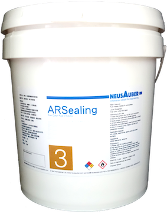

.. _h6718039516352858182137592131:

Products
********

 

.. _h8567d1a5f4c5b126a5c5a761b4d322d:

ARPrimer M3100 True Color Rust Inhibitor
========================================

+-----------------------------------------------------------------------------------------------------------------------------------------------------------------------------------------------------------------------------------------------------------------------------------------------------------------------------------------------------------------------------------------------------------------------------------------------------------------------------------------------------------------------------------------------------------------+----------+
|ARPrimer True Color Rust Inhibitor is Europe-originated technology. It creates an ultra-thin and transparent layer on the surface to protect your assets and equipments. It works even on rusted surfaces with no need to polish the surface in advance. ARPrimer has dual effectiveness. It not only immediately stops corrosion, protects from further corrosion but also is a primer of paints. You can directly paint on the ARPrimer protected surface, any kind of primer of paints such as Epoxy, PU, Acrylic and PET is no more required before painting.|\ |IMG1|\ |
|                                                                                                                                                                                                                                                                                                                                                                                                                                                                                                                                                                 |          |
|Can be applied to all kinds of metal materials, paint surface for food industry equipment, machinery and equipment, components, bolts, construction, landscape, art and so on. Seaside, hot spring areas and other harsh environments can be used.                                                                                                                                                                                                                                                                                                               |          |
|                                                                                                                                                                                                                                                                                                                                                                                                                                                                                                                                                                 |          |
|Applicable temperature range：+250 ~ -190℃                                                                                                                                                                                                                                                                                                                                                                                                                                                                                                                       |          |
|                                                                                                                                                                                                                                                                                                                                                                                                                                                                                                                                                                 |          |
|Average usage：200 m\ |STYLE0|\  /Gallon                                                                                                                                                                                                                                                                                                                                                                                                                                                                                                                         |          |
|                                                                                                                                                                                                                                                                                                                                                                                                                                                                                                                                                                 |          |
|Package：1、5、20 Gallon                                                                                                                                                                                                                                                                                                                                                                                                                                                                                                                                         |          |
+-----------------------------------------------------------------------------------------------------------------------------------------------------------------------------------------------------------------------------------------------------------------------------------------------------------------------------------------------------------------------------------------------------------------------------------------------------------------------------------------------------------------------------------------------------------------+----------+

.. _h2c1d74277104e41780968148427e:

.. _h181bc196a3f1ba277c4e1d27d265:

ARSealing M3300 True Color Rust Inhibitor
=========================================

+------------------------------------------------------------------------------------------------------------------------------------------------------------------------------------------------------------------------------------------------------------------------------------------------------------------------------------------+------------+
|                                                                                                                                                                                                                                                                                                                                          |  \ |IMG2|\ |
|                                                                                                                                                                                                                                                                                                                                          |            |
|AR True Color  Rust Inhibitor can stop corrosion and provide protection against corrosion immediately. With the Europe-originated technology, it takes effect even on  rusted surfaces with no need to polishing the surface in advance. It creates an ultra-thin and transparent layer on the surface of protected assets and equipments.|            |
|                                                                                                                                                                                                                                                                                                                                          |            |
|AR True Color Rust Inhibitor works on all kinds of metals or painted surfaces, such as mechanical parts, building components, steel frames, screws as well as artworks.                                                                                                                                                                   |            |
|                                                                                                                                                                                                                                                                                                                                          |            |
|                                                                                                                                                                                                                                                                                                                                          |            |
|Applicable temperature range：+250 ~ -190℃                                                                                                                                                                                                                                                                                                |            |
|Average usage：200 m2 /Gallon                                                                                                                                                                                                                                                                                                             |            |
|                                                                                                                                                                                                                                                                                                                                          |            |
|Package：1、5、20 Gallon                                                                                                                                                                                                                                                                                                                  |            |
|                                                                                                                                                                                                                                                                                                                                          |            |
+------------------------------------------------------------------------------------------------------------------------------------------------------------------------------------------------------------------------------------------------------------------------------------------------------------------------------------------+------------+

|REPLACE1|

|REPLACE2|

.. bottom of content

.. |STYLE0| replace:: :sup:`2`

.. |REPLACE1| raw:: html

    
.. |REPLACE2| raw:: html

    
.. |IMG1| image:: static/產品_圖片版_1.png
   :height: 204 px
   :width: 160 px

