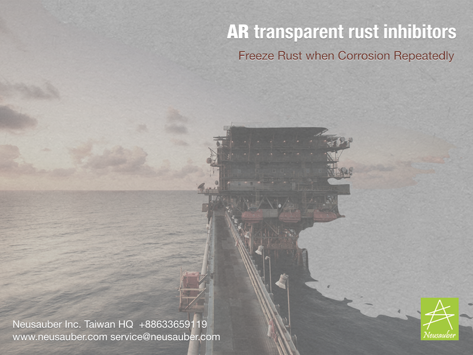
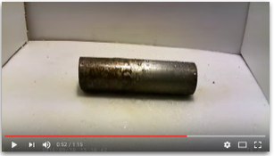
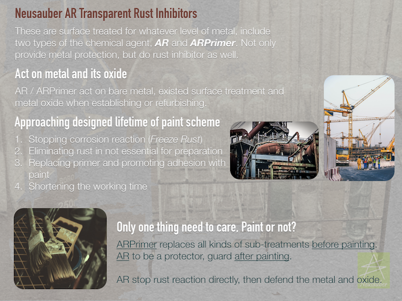
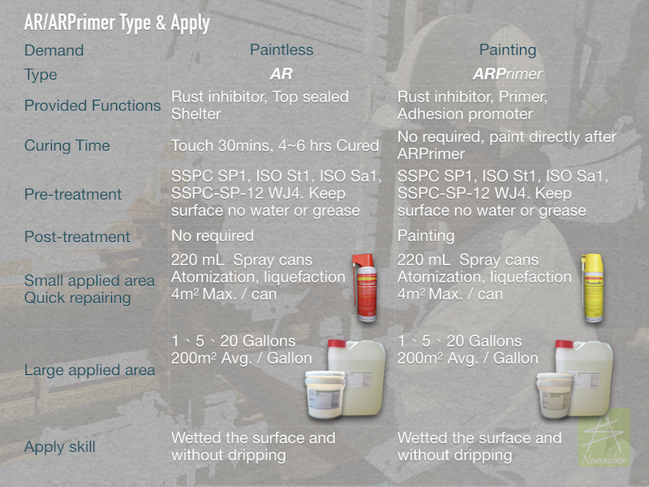
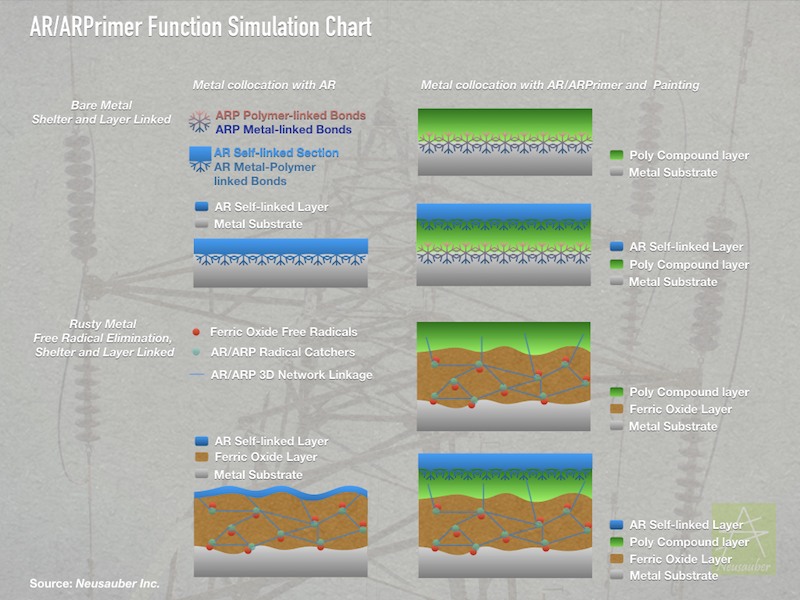
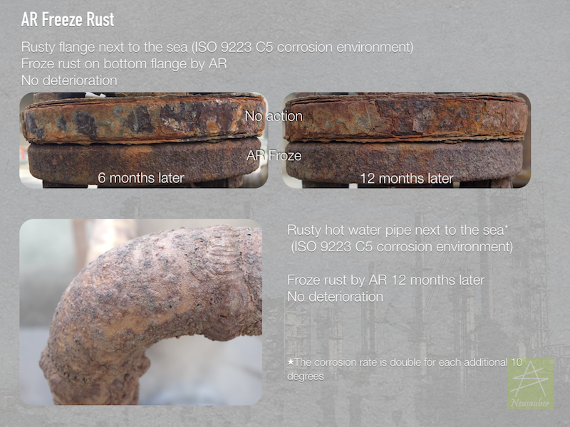
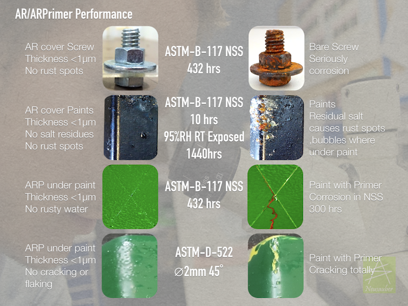
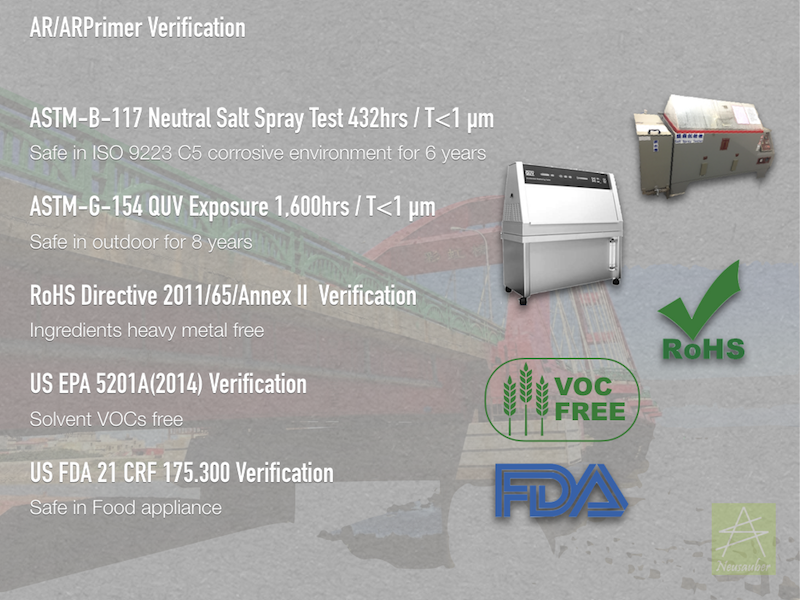
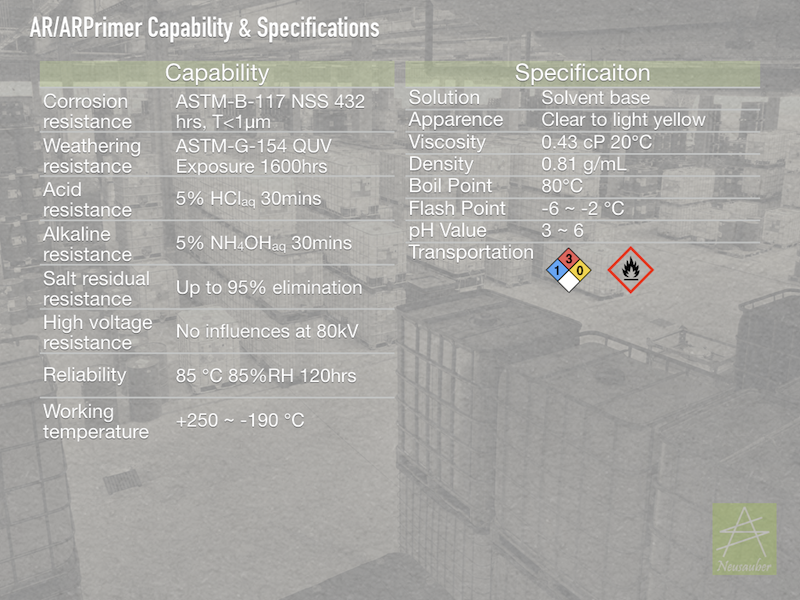

.. _h6718039516352858182137592131:

Products
********

 

|REPLACE1|

\ |IMG1|\ \ |IMG2|\ 

|REPLACE2|

.. _h2c1d74277104e41780968148427e:

+--------------------------------------------------+---+
|Allsome SV500 Vehicle Protect Coating             |   |
|                                                  |   |
|* All materials used of vehicle                   |   |
|                                                  |   |
|* Hydrophobic layer without PFCs                  |   |
|                                                  |   |
|* Quick Apply system                              |   |
|                                                  |   |
|* Easily maintain surface                         |   |
|                                                  |   |
|* Keeping surface clean and shining with long time|   |
|                                                  |   |
+--------------------------------------------------+---+

.. bottom of content

.. |REPLACE1| raw:: html

    
.. |REPLACE2| raw:: html

    

