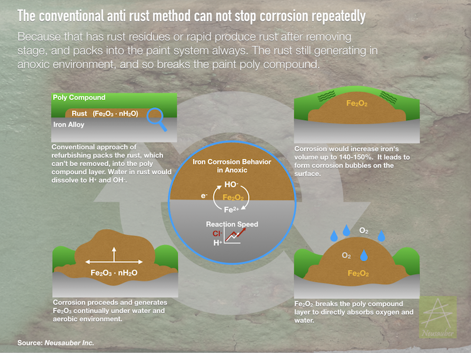

.. _h1634483c7822441972316c7301545:

產品
****

+------+----------+----------------------------------+
|型號  |材料      |用途案例                          |
+------+----------+----------------------------------+
|AR600 |金屬      |鋼材、鑄鐵、裝置藝術等(特長效版)  |
+------+----------+----------------------------------+
|AR600C|金屬      |銅、青銅、鑄鐵、文物、古物專用    |
+------+----------+----------------------------------+
|AR600E|金屬      |鋼材、鑄鐵、裝置藝術等(長效版)    |
+------+----------+----------------------------------+
|AR600M|金屬      |模具專用                          |
+------+----------+----------------------------------+
|SV500 |車身、玻璃|汽車鍍膜(快速施工版)              |
+------+----------+----------------------------------+
|SV600 |車身、玻璃|汽車鍍膜                          |
+------+----------+----------------------------------+
|SV500G|玻璃      |室內玻璃(快速施工版)              |
+------+----------+----------------------------------+
|SV600G|玻璃      |玻璃帷幕、大樓落地窗、太陽能玻璃等|
+------+----------+----------------------------------+
|SV600T|磁磚      |大樓外牆磁磚、浴室等              |
+------+----------+----------------------------------+

 

.. _h2c1d74277104e41780968148427e:

.. _h25721e2a6249724f373a2f45a4d8073:

AR600鋼材、鑄鐵、裝置藝術等(特長效版)
=====================================

\ |LINK1|\ 

本劑可填滿金屬表層毛細孔強化防鏽,或將原有的鐵鏽轉成鈍化護膜。

.. _h174fb648377959437b5c1f697c1c40:

新金屬品
--------

金屬材料在運送、組立、螺絲鎖附、焊接後,表面原有的防鏽處理因受力、高溫熔融的破壞而失效,即使是白鐵或是不鏽鋼材質也一樣都會有快速生鏽或鏽水問題。AR 600透明防鏽劑為金屬表面防鏽處理劑,利用產生透明膜層的方式強化金屬表面的防鏽保護,以排除溼氣的方式減少氧化作用。經過AR透明防鏽劑的處理之後,可達96小時鹽霧試驗,可將金屬原有的防鏽能力提昇5~10倍。

.. _h572187820253c7294643631303029:

已鏽金屬品
----------

鏽蝕後的金屬,必須先除鏽或止鏽才能再上漆或其它表面處理,AR 600可凍結鏽蝕(止鏽),並將鏽轉成鈍化膜,表面再形成透明疏水膜層,給予重新防鏽的能力。

\ |IMG1|\ 

    本影片用鏽蝕極度嚴重的抽水馬達，展示AR600的防鏽能力。

\ |IMG2|\ 

    本影片將一段金屬材料分成左右兩組，以縮時攝影互相對照的方式展示AR600優越能力。

 

.. _h5734167f485553f163014a6a7a3071:

AR600C 銅、青銅、鑄鐵、文物、古物專用
=====================================

文物保存專用產品

.. _h13c7979752c66b6e554e6b2b373629:

AR600E鋼材、鑄鐵、裝置藝術等(長效版)
====================================

\ |LINK2|\ 

從現在起,您的模具工廠也可以跟日本、德國現代化的模具工廠一樣清新乾淨。 您是否因防鏽油、黃油、藍丹、紅丹產生的問題而困擾。傳統台廠的模具保養 方式,造成模具油膩膩沾滿灰塵,空氣中充滿油騷味,衣物沾惹油污。模具使 用前需使用去油清潔劑強力洗淨,吹乾等繁瑣手續。這些問題都將因為AR600E 在台自行研發成功而獲得解決。

.. _hb7d68384f57596a66437e107d61d6c:

AR600M模具專用
==============

\ |LINK3|\ 

.. _h2c1d74277104e41780968148427e:

從現在起,您的模具工廠也可以跟日本、德國現代化的模具工廠一樣清新乾淨。 您是否因防鏽油、黃油、藍丹、紅丹產生的問題而困擾。傳統台廠的模具保養 方式,造成模具油膩膩沾滿灰塵,空氣中充滿油騷味,衣物沾惹油污。模具使 用前需使用去油清潔劑強力洗淨,吹乾等繁瑣手續。這些問題都將因為AR600M 在台自行研發成功而獲得解決。

 

.. _h14586e314b2e4f1b417d14a49734d4c:

SV500汽車鍍膜(快速施工版)
=========================

\ |LINK4|\ 

本產品可在汽擋玻璃、後照 鏡、前後 窗等玻璃,使玻璃具備撥水性與防油性,時時維護視線清晰。也可使用在車身鈑件,使不易吸塵,若附著塵 也容易清除,維護容易潔亮清爽。

快速施工版使用高透明性材料,容易抹勻,塗布面積大,施工快速省時、省力。

\ |IMG3|\ 

    本影片為SV500在汽車玻璃及車身使用前後的錄影，展示SV500的優異特性。

 

.. _h2a807d59d45693331a5964691d71d:

SV600汽車鍍膜
=============

\ |LINK5|\ 

本產品可在汽擋玻璃、後照鏡、前後窗等玻璃,使玻璃具備撥水性與防油性,耐雨刷磨耗能力高,時時維護視線清晰。也可使用在車身鈑件,使不易吸塵,若附著塵 也容易清除,維護容易潔亮清爽。

.. _h1427e3a4140777e736e591623712a7e:

SV500G室內玻璃(快速施工版)
==========================

本產品可使用在所有玻璃、陶瓷、磁磚、石製品、寶石等表面,深入填補毛細孔,形成表面滑順透明之保護薄膜,不吸附髒污、燒香油煙不易附著,維持光亮表面。用水或沾水抹布即可輕鬆清潔保養,不需再使用任何清潔劑清洗。適用於居家、店家、廟宇神龕之玻璃、表框、石刻、磁磚等製品。快速施工版使用高透明性材料,容易抹勻,塗布面積大,施工快速省時、省力。

 

.. _h246265f56632723b2a3c2b461f1a2b:

SV600G玻璃帷幕、大樓落地窗、太陽能玻璃等
========================================

本品可使用在戶外玻璃、陶瓷、磁磚、石製品等，深入填補毛細孔,形成表面透明之保護薄膜,高耐候設計效果持久。表面疏水、易潔，防止雨後水垢、污垢產生，長期維持表面乾淨亮麗。用水或沾水抹布即可輕鬆清潔保養,不需再使用任何清潔劑清洗。適用於所有玻璃帷幕、大樓落地窗、太陽能玻璃等。

 

.. _h152e3a1913d56f4b34776e275d1172:

SV600T大樓外牆磁磚、浴室等
==========================

本品專應用於大樓外牆磁磚、石材等建築製品，深入填補毛細孔,形成表面透明之保護薄膜,特高耐候設計效果持久。表面疏水、易潔，防止雨後水垢、污垢、青苔產生，長期維持表面乾淨亮麗。大樓清潔僅需使用清水，無需再使用任何藥劑，不會造成二次污染與其他動、植物傷害。乾淨、環保，維持建築亮麗如新之高品質形像。

本公司產品可應用於金屬、玻璃、陶瓷等材質，可依據行業需求訂製特規產品，歡迎各行業來電洽詢。

.. |LINK1| raw:: html

    <a href="http://www.neusauber.com/docs/AR600/dm.pdf" target="_blank">下載型錄</a>

.. |LINK2| raw:: html

    <a href="http://www.neusauber.com/docs/AR600/dm.pdf" target="_blank">下載型錄</a>

.. |LINK3| raw:: html

    <a href="http://www.neusauber.com/docs/AR600M/dm.pdf" target="_blank">下載型錄</a>

.. |LINK4| raw:: html

    <a href="http://www.neusauber.com/docs/SV/SV500DataSheet.pdf" target="_blank">下載型錄</a>

.. |LINK5| raw:: html

    <a href="http://www.neusauber.com/docs/SV/SV600DataSheet.pdf" target="_blank">下載型錄</a>

.. |IMG1| image:: static/products_1.png
   :height: 174 px
   :width: 302 px
   :target: https://www.youtube.com/watch?v=eIx9JPzWINQ

