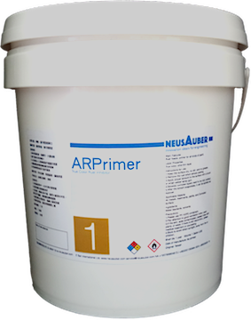

.. _h6718039516352858182137592131:

Products
********

 

.. _h182f521a41561a52521e2255602c70:

AR Transparent Rust Inhibitor
=============================

|REPLACE1|

.. _h747b1c6d60466c1e2c7172e7b1d6b19:

AR Transparent Rust Inhibitor Aerosol
=====================================

|REPLACE2|

.. _h207f4f2123281b1769184662691c3b5e:

ARPrimer Transparent Rust Inhibitor
===================================

.. _h2c1d74277104e41780968148427e:

|REPLACE3|

.. _h2c1d74277104e41780968148427e:

.. _h1c363491f2b0323b43496d6a4b3061:

ARPrimer Transparent Rust Inhibitor Aerosol
===========================================

|REPLACE4|

|REPLACE5|

|REPLACE6|

.. bottom of content

.. |REPLACE1| raw:: html

    <table cellspacing="0" cellpadding="0" style="width:86%">
    <tbody>
    <tr><th style="width:50%;vertical-align:Top;padding-top:5px;padding-bottom:5px;padding-left:5px;padding-right:5px">

AR Transparent Rust Inhibitor can stop corrosion and provide protection against corrosion immediately. With the Europe-originated technology, it takes effect even on  rusted surfaces with no need to polishing the surface in advance. It creates an ultra-thin and transparent layer on the surface of protected assets and equipments.

AR Transparent Rust Inhibitor works on all kinds of metals or painted surfaces, such as mechanical parts, building components, steel frames, screws as well as artworks.

Applicable temperature range：+250 ~ -190℃

Average usage：200 m2 /Gallon

Package：1、5、20 Gallon

</th><td style="width:50%;vertical-align:Top;padding-top:5px;padding-bottom:5px;padding-left:5px;padding-right:5px">
    
</td></tr>
    </tbody></table>

.. |REPLACE2| raw:: html

    <table cellspacing="0" cellpadding="0" style="width:100%">
    <tbody>
    <tr><td style="vertical-align:Top;padding-top:5px;padding-bottom:5px;padding-left:5px;padding-right:5px;border:solid 1px #000000">
Vollume：220mL

Average use area：4 m2  max
</td><td style="vertical-align:Top;padding-top:5px;padding-bottom:5px;padding-left:5px;padding-right:5px;border:solid 1px #000000">
          
</td></tr>
    </tbody></table>

.. |REPLACE3| raw:: html

    <table cellspacing="0" cellpadding="0" style="width:100%">
    <tbody>
    <tr><td style="vertical-align:Top;padding-top:5px;padding-bottom:5px;padding-left:5px;padding-right:5px;border:solid 1px #000000">

ARPrimer Transparent Rust Inhibitor is Europe-originated technology. It creates an ultra-thin and transparent layer on the surface to protect your assets and equipments. It works even on rusted surfaces with no need to polish the surface in advance. ARPrimer has dual effectiveness. It not only immediately stops corrosion, protects from further corrosion but also is a primer of paints. You can directly paint on the ARPrimer protected surface, any kind of primer of paints such as Epoxy, PU, Acrylic and PET is no more required before painting.

Can be applied to all kinds of metal materials, paint surface for food industry equipment, machinery and equipment, components, bolts, construction, landscape, art and so on. Seaside, hot spring areas and other harsh environments can be used.

Applicable temperature range：+250 ~ -190℃

Average usage：200 m2 /Gallon

Package：1、5、20 Gallon
</td><td style="vertical-align:Top;padding-top:5px;padding-bottom:5px;padding-left:5px;padding-right:5px;border:solid 1px #000000">
    
</td></tr>
    </tbody></table>

.. |REPLACE4| raw:: html

    <table cellspacing="0" cellpadding="0" style="width:100%">
    <tbody>
    <tr><td style="vertical-align:Top;padding-top:5px;padding-bottom:5px;padding-left:5px;padding-right:5px">

Vollume：220mL

Average use area：4 m2  max
</td><td style="vertical-align:Top;padding-top:5px;padding-bottom:5px;padding-left:5px;padding-right:5px">
          
</td></tr>
    </tbody></table>

.. |REPLACE5| raw:: html

    
.. |REPLACE6| raw:: html

    

.. |IMG3| image:: static/產品_圖片版_3.png
   :height: 365 px
   :width: 309 px

.. |IMG4| image:: static/產品_圖片版_4.png
   :height: 369 px
   :width: 130 px
