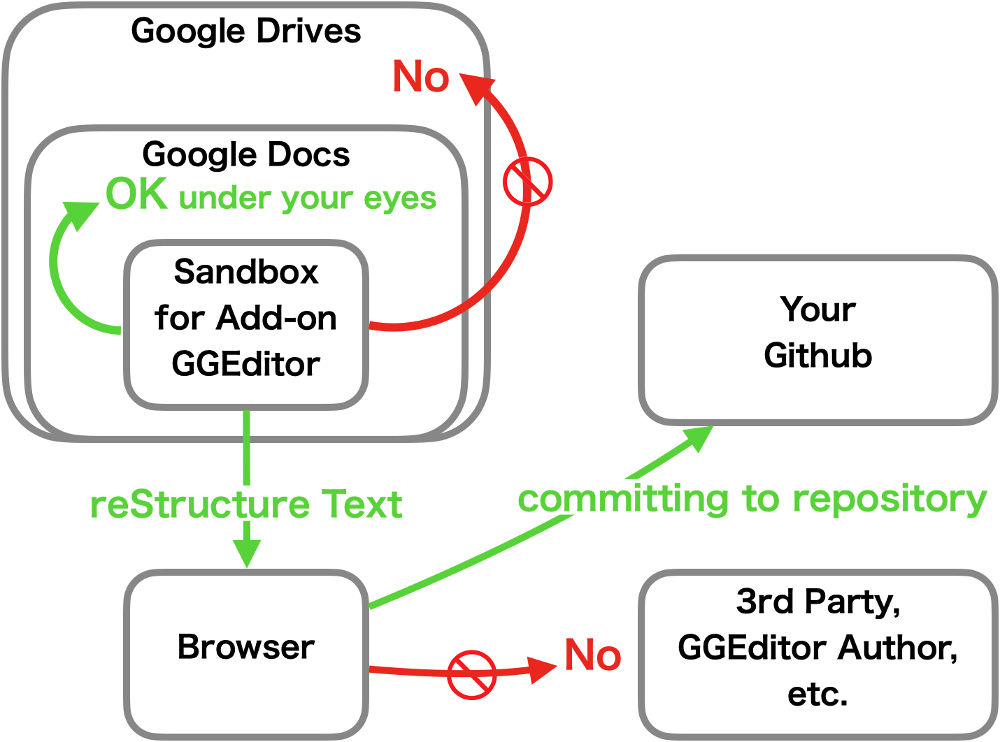

.. _h49524b215a3444161b59634b48494a43:

Privacy Policy of GGeditor
**************************

version 2021

The GGeditor is an Google Docs Addon, it is developped and running within the sandbox of the Google Docs System. Within the sandbox, it accesses, inserts content into user's document and stores user's settings.  

The GGeditor's major feature is to convert a Google Doc document into text of reStructured format, then exports the text content to the Github repository owned by the same user. It does not share any content to any parities nor the GGeditor author.  The conversion and exporting to the Github is all under user's manual operation.

As an Add-on of the Google Docs, the GGeditor does anything by user's interaction. There is no automation in background. The GGeditor does not collect any Google users' data, neither no Google Analytics to watch usage behavior (I am not saying that Google does not do it when a user activates the GGeditor Add-on, actually I have no idea whether they do it or not, I am just saying that the GGeditor does not collect any data for watching usage behavior).

\ |IMG1|\ 

.. bottom of content

