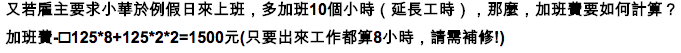
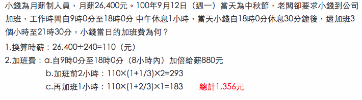

.. _h174fb648377959437b5c1f697c1c40:

常見問題
********

.. _h471d1253d751a2c4465794a4e7c5a7c:

為什麼網路上的資料非常混淆？
============================

``說明``：很多媒體跟網路上的資料都在講「加班費」該怎麼算，可是越看越糊塗，問題關鍵在於「加班費」有兩種意義被混淆，例如，資料上都把星期六到公司上班的工資稱為「加班費」，那麼要怎麼稱呼「在星期六工作八小時之後的繼續工作」？「加班的加班費」是嗎？這情況在語言上講不清楚，資料也就很難找，也很容易雞同鴨講。為了釐清差異，本文將用以下的方式稱呼，作為區別。

+--------------------+--------+
|時段                |名稱    |
+====================+========+
|前八小時            |工作時段|
+--------------------+--------+
|第九小時到第十二小時|加班時段|
+--------------------+--------+

也就是說，前八小時一律稱為「工作」，後四小時一律稱為「加班」。所以星期六上班的工資，稱為「例假日上班工資」或者「休息日上班工資」，因為星期六算休息日或例假日是二擇一，因人而異，總之，前八小時工資都叫做上班工資。只有把後四小時稱為「加班工資」。這樣才不會顯得資訊很混亂，避免無謂的爭論。

還有一種混淆是來自語意不清，以時薪150元的員工為例，休息日前八小時加班費到底是1588元還是588元呢？兩種講法都可能出現，要看講的人是否把當日基本薪資1000算入「加班費」。為了避免這種混淆，本計算機以「額外」來作區隔。凡是月薪之外的所得，都稱為「額外」。

那麼勞基法怎麼說呢？勞基法上稱為「延長工時」，因為不是使用日常用語，如果看勞委會的法令解釋，只會越看越不知所云，所以本計算機不採用正式的法律用語。

.. _h2276373c576d1c241659471e414b00:

「國慶日」是休息日還是例假日？
==============================

沸沸揚揚的勞基法修正案，爭論所謂「一例一休」、「砍假七日」的問題，許多人對於何謂例假日，何謂休息日搞不清楚，請問，「國慶日」是休息日還是例假日？

``說明``：都不是，國慶日是「休假日」。

.. _h65a754d314849631d4f1770f68746b:

「國慶日」加班費該怎麼算？
==========================

媒體報導跟網路資料，關於「一例一休」都是在講「休息日」跟「例假日」的差異，但國慶日是「休假日」，那麼國慶日加班費該怎麼算？

``說明``：不很確定，以下是蒐集到的資料，可能是這樣：

+----------------------------+---+--------------------------------------------------+--------------------------------------------------------------------------------+--------------------------------------+-------------+
|加班類型代碼                |   |A工作日                                           |B休息日                                                                         |C例假日                               |D休假日      |
+============================+===+==================================================+================================================================================+======================================+=============+
|加班類型                    |1  |工作日加班                                        |休息日工作                                                                      |例假日工作                            |休假日工作   |
+----------------------------+---+--------------------------------------------------+--------------------------------------------------------------------------------+--------------------------------------+-------------+
|當日月薪之外的額外工資      |2  |無；因月薪已包含                                  |前兩小時三分之一時薪、後六小時三分之二時薪;不滿四小時算四小時;不滿八小時算八小時|只要有工作的事實，不論多久，就算八小時|同例假日     |
+----------------------------+---+--------------------------------------------------+--------------------------------------------------------------------------------+--------------------------------------+-------------+
|當日加班費（超過八小時之後）|3  |前兩小時一又三分之一時薪、後兩小時一又三分之二時薪|同工作日（另一種講法是，不滿12小時算12小時，這一時段一次要算4小時）             |同工作日                              |同工作日     |
+----------------------------+---+--------------------------------------------------+--------------------------------------------------------------------------------+--------------------------------------+-------------+
|加班費最小單位              |4  |一小時；不滿一小時算一小時（這只是一種講法）      |同工作日                                                                        |同工作日                              |同工作日     |
+----------------------------+---+--------------------------------------------------+--------------------------------------------------------------------------------+--------------------------------------+-------------+
|加班時間限制                |5  |四小時                                            |同工作日                                                                        |同工作日                              |同工作日     |
+----------------------------+---+--------------------------------------------------+--------------------------------------------------------------------------------+--------------------------------------+-------------+
|補休                        |6  |不必                                              |不必                                                                            |要                                    |不必         |
+----------------------------+---+--------------------------------------------------+--------------------------------------------------------------------------------+--------------------------------------+-------------+
|計入每月加班限額46小時內    |7  |當日超過八小時的部分                              |當日都須計入                                                                    |只算當日超過八小時的部分              |同（C）例假日|
+----------------------------+---+--------------------------------------------------+--------------------------------------------------------------------------------+--------------------------------------+-------------+

* 關於B3，C3，D3，也就是非工作日超過八小時加班該怎麼算，目前筆者仍不確定。

* 關於A4-D4，也就是加班費折算最小單位，目前筆者仍不確定。

.. _h106d6a60386b4471802c17574203f54:

休息日上班工資怎麼算？
======================

.. _h65a754d314849631d4f1770f68746b:

特休屬於休息日還是例假日？
==========================

.. _h57574e4f5e306a1f6a391d2041155b23:

加班未滿一小時算一小時？
========================

.. _h2b2421b4116211c605521764a585e2b:

加班那天，既是休息日又是國定假日，加班費怎麼算？
================================================

如果你選擇週六是休息日，可是週六遇到國定假日（例假日），那天的加班算哪一種？

.. _h57574e4f5e306a1f6a391d2041155b23:

非工作日的加班費怎麼算？
========================

非工作日，也就是B，C，D這三種日子。非工作日的加班費是指B3，C3，D3，這三種情況。

.. _h174fb648377959437b5c1f697c1c40:

參考資料
========

+-----------------------------+------------------------------------------------------------------------------------------------------------------------------------------------------------------------------------------------------------------------------------------------------------------------------------------------+
|連結                         |備註                                                                                                                                                                                                                                                                                            |
+-----------------------------+------------------------------------------------------------------------------------------------------------------------------------------------------------------------------------------------------------------------------------------------------------------------------------------------+
|\ |LINK1|\                   |                                                                                                                                                                                                                                                                                                |
+-----------------------------+------------------------------------------------------------------------------------------------------------------------------------------------------------------------------------------------------------------------------------------------------------------------------------------------+
|                             |                                                                                                                                                                                                                                                                                                |
+-----------------------------+------------------------------------------------------------------------------------------------------------------------------------------------------------------------------------------------------------------------------------------------------------------------------------------------+
|                             |                                                                                                                                                                                                                                                                                                |
+-----------------------------+------------------------------------------------------------------------------------------------------------------------------------------------------------------------------------------------------------------------------------------------------------------------------------------------+
|\ |LINK2|\                   |這個系統上使用的詞彙是「週休二日」而不是「一例一休」這種常見的說法。目前關於休息日工資算法有很多講法，本計算機以此網站為準。因為這個網站使用「額外工資」的文字，感覺比較明確。                                                                                                                  |
|                             |                                                                                                                                                                                                                                                                                                |
|                             |這個試算機的問題是過於簡單，似乎主要是為了宣導用途，\ |LINK3|\ 。很多細節問題無法透過這個試算機得到解答。例如，超時1分鐘算1小時嗎？不滿一小時，是否算一小時呢？                                                                                                                                 |
|                             |                                                                                                                                                                                                                                                                                                |
+-----------------------------+------------------------------------------------------------------------------------------------------------------------------------------------------------------------------------------------------------------------------------------------------------------------------------------------+
|\ |LINK4|\                   |這系統提供三種類型：平常、 休假日(含特休)、例假日。請注意，這裡，沒有「休息日」，而且把特休算為「休假日」，休假日在新制中，是歸於「例假日」。到底是休假日是不是例假日，如果不一樣，特休算哪一種，光是在這個地方就令人越看越混淆。                                                               |
|                             |                                                                                                                                                                                                                                                                                                |
|                             |我以月薪3600，2016/12/10星期六工作八小時為例， 休假日(含特休)、例假日兩種項目，算出來的都是1200。跟勞動部試算比較，不是「週休二日（一例一休）」也不是「舊制」而是沒通過的「兩例假草案」。                                                                                                       |
|                             |                                                                                                                                                                                                                                                                                                |
|                             |不知道到底這個試算系統是哪一制，或者台中市有自己的規定？                                                                                                                                                                                                                                        |
+-----------------------------+------------------------------------------------------------------------------------------------------------------------------------------------------------------------------------------------------------------------------------------------------------------------------------------------+
|\ |LINK5|\                   |與台中市政府勞動局提供的試算機似乎是同一版本。問題相同。                                                                                                                                                                                                                                        |
|                             |                                                                                                                                                                                                                                                                                                |
|                             |但是，台北市政府的版本比台中市政府版本多一個中秋節的範例，使用的算法是「例假日」的算法，在這裡我們看到一個「例假日加班」的案例，以此案例並沒有力安會計師事務所所說的「兩倍」。到底這個計算器沒有更新，還是力安會計師事務所弄錯了呢，不可得知。                                                  |
|                             |                                                                                                                                                                                                                                                                                                |
+-----------------------------+------------------------------------------------------------------------------------------------------------------------------------------------------------------------------------------------------------------------------------------------------------------------------------------------+
|\ |LINK6|\                   |報導上說「休息日只要徵得勞工同意就可上班；不過僱主須付加班費，除原本工資外，加班頭2小時各可再獲1又1/3（即4/3）加班費，2小時之後可獲得1又2/3（即5/3）加班費，且一次至少發給4小時，不滿1小時也要發4小時，等於若勞工休息日加班1小時，可獲6小時加班費。」                                           |
|                             |                                                                                                                                                                                                                                                                                                |
|                             |六倍怎麼算出來的內文沒講？猜是指當天只做五個小時的話，第五小時雖然只有一小時，要算四小時，於是效益是 5/3 \* 4 = 6.67。                                                                                                                                                                          |
|                             |                                                                                                                                                                                                                                                                                                |
|                             |在這篇報導後面有休息日加班的試算，表示新制加班費是1900，比舊制700為優。按其文意，1900尚不包括當日薪資1200。換言之，當日總所得為3100。這一講法又跟力安會計師事務所的算法發生衝突。                                                                                                               |
+-----------------------------+------------------------------------------------------------------------------------------------------------------------------------------------------------------------------------------------------------------------------------------------------------------------------------------------+
|\ |LINK7|\ (Now News)        |這篇報導出現B休息日加班不足12小時算12小時的說法，但沒說C與D比照辦理。                                                                                                                                                                                                                           |
+-----------------------------+------------------------------------------------------------------------------------------------------------------------------------------------------------------------------------------------------------------------------------------------------------------------------------------------+
|\ |LINK8|\ (力安會計師事務所)|休息日工作時段薪資怎麼算？這篇的算法是不包括當日工資，因為當日工資已經包含在月薪中。但是這一說法與蘋果日報的報導及勞動部的試算機相衝突。                                                                                                                                                        |
|                             |                                                                                                                                                                                                                                                                                                |
|                             |例假日加班薪資怎麼算？這篇的算法（在示範案例中）是工時的兩倍，而不是平常工作日的4/3。這跟冰與火的世界部落格上引用的勞動部解釋函說法不一樣。                                                                                                                                                     |
|                             |                                                                                                                                                                                                                                                                                                |
+-----------------------------+------------------------------------------------------------------------------------------------------------------------------------------------------------------------------------------------------------------------------------------------------------------------------------------------+
|\ |LINK9|\                   |例假日（文舉端午節為例）加班薪資怎麼算？這篇的算法與平常工作日相同。與力安會計師事務所的算法不同。內文引用「行政院勞工委員會87年9月14日台(87)勞動二字第39675號函」，說明例假日超過八小時部分比照勞基法24條，本計算機目前採用這種算法。不過這篇文章中的案例的加總算錯了，應該是2167，而不是2267。|
+-----------------------------+------------------------------------------------------------------------------------------------------------------------------------------------------------------------------------------------------------------------------------------------------------------------------------------------+
|\ |LINK10|\                  |跟蘋果日報的內容雷同，更簡略。                                                                                                                                                                                                                                                                  |
+-----------------------------+------------------------------------------------------------------------------------------------------------------------------------------------------------------------------------------------------------------------------------------------------------------------------------------------+
|\ |LINK11|\                  |這系統沒有列出發問跟回答的時間，由於法律條文是有時間性的，所以這網頁的資料不具參考價值。                                                                                                                                                                                                        |
+-----------------------------+------------------------------------------------------------------------------------------------------------------------------------------------------------------------------------------------------------------------------------------------------------------------------------------------+
|\ |LINK12|\ （東森新聞）     |這則報導大概是媒體報導中比較詳細的，至少有張圖表。本則報導關於休息日的算法也是採取額外再增加一日薪的版本，與勞動部試算機相同，而與力安會計師事務所的版本不一樣。                                                                                                                                |
+-----------------------------+------------------------------------------------------------------------------------------------------------------------------------------------------------------------------------------------------------------------------------------------------------------------------------------------+
|\ |LINK13|\                  |在這則新聞中，關於休息日的工資採取的也是多數的看法，只是顯然把「休假日」與「休息日」搞混了。題目中的休假日應該是休息日。                                                                                                                                                                        |
+-----------------------------+------------------------------------------------------------------------------------------------------------------------------------------------------------------------------------------------------------------------------------------------------------------------------------------------+
|\ |LINK14|\                  |在這篇報導中出現一個別人沒有的「輪休日」，但又括號「現行規定」，意思似乎是與新制不同可以忽略。可是，算法跟「勞工新制下之加班費計算」力安會計師事務所的版本相同。到底是怎麼回事？不知道。                                                                                                        |
+-----------------------------+------------------------------------------------------------------------------------------------------------------------------------------------------------------------------------------------------------------------------------------------------------------------------------------------+
|\ |LINK15|\                  |這篇報導跟上則自由時報的報導各有一張圖表，這兩張算是比較清楚明確的圖表。                                                                                                                                                                                                                        |
+-----------------------------+------------------------------------------------------------------------------------------------------------------------------------------------------------------------------------------------------------------------------------------------------------------------------------------------+
|\ |LINK16|\                  |「加班不滿一小時到底要不要算一小時？」這個問題仍無明確資料，這則連結是公務員的算法，照此要點公務員是一律不算（支給標準第二點）。                                                                                                                                                                |
+-----------------------------+------------------------------------------------------------------------------------------------------------------------------------------------------------------------------------------------------------------------------------------------------------------------------------------------+

附圖：力安會計師事務所例假日加班的算法

\ |IMG1|\ 

附圖：台北市政府例假日加班的算法

\ |IMG2|\ 

.. bottom of content

.. |LINK1| raw:: html

    <a href="http://law.moj.gov.tw/LawClass/LawAll.aspx?PCode=N0030001" target="_blank">勞基法</a>

.. |LINK2| raw:: html

    <a href="http://labweb.mol.gov.tw/index_2.html#monthlyPay=36000&regularDayOffWorkReason=disaster&workhours=8%2C8%2C8%2C8%2C8%2C8%2C0" target="_blank">勞動部試算系統</a>

.. |LINK3| raw:: html

    <a href="http://www.cna.com.tw/news/firstnews/201607210047-1.aspx" target="_blank">根據報導這個試算機是從gov改過來的</a>

.. |LINK4| raw:: html

    <a href="http://www.labor.taichung.gov.tw/sp.asp?xdurl=superXD/labor/overTimePayCalculate.asp&ctNode=3945&mp=117010&icuitem=1376995" target="_blank">台中市政府勞動局提供的試算</a>

.. |LINK5| raw:: html

    <a href="http://web2.bola.taipei/cutweb/a2.asp" target="_blank">台北市政府勞動局提供的試算</a>

.. |LINK6| raw:: html

    <a href="http://www.appledaily.com.tw/appledaily/article/headline/20160629/37287841/" target="_blank">休息日加班 最高1小時領6倍薪（蘋果日報）</a>

.. |LINK7| raw:: html

    <a href="http://www.nownews.com/n/2016/06/29/2151374" target="_blank">行政院擬新制　一例一休加班費這樣算</a>

.. |LINK8| raw:: html

    <a href="http://eehscpafirm.com/practical-analysis/75..." target="_blank">勞工新制下之加班費計算</a>

.. |LINK9| raw:: html

    <a href="http://53973000.blogspot.tw/2014/12/blog-post_11.html" target="_blank">冰與火的世界部落格</a>

.. |LINK10| raw:: html

    <a href="http://news.tvbs.com.tw/politics/661360" target="_blank">一例一休加班費大躍進！做1小時可領6小時薪水（TVBS）</a>

.. |LINK11| raw:: html

    <a href="https://tw.answers.yahoo.com/question/index?qid=20071026000010KK02166" target="_blank">加班未滿1小時要怎麼計算薪資?(Yahoo 知識+)</a>

.. |LINK12| raw:: html

    <a href="http://news.ebc.net.tw/news.php?nid=45008" target="_blank">「一例一休」加班費怎麼算？一張圖告訴你</a>

.. |LINK13| raw:: html

    <a href="http://a.udn.com/focus/2016/07/10/23032/index.html" target="_blank">5題讓你搞懂「一例一休」在談什麼（聯合報）</a>

.. |LINK14| raw:: html

    <a href="http://news.ltn.com.tw/photo/focus/paper/695944" target="_blank">新版加班費有4種 後遺症不少（自由時報）</a>

.. |LINK15| raw:: html

    <a href="http://www.setn.com/News.aspx?NewsID=205649" target="_blank">勞工必看！「一例一休」4種加班費怎麼算（三立新聞）</a>

.. |LINK16| raw:: html

    <a href="http://weblaw.exam.gov.tw/LawArticle.aspx?LawID=J060242004" target="_blank">行政院人事行政總處加班及加班費支給要點(103/3/23)</a>

