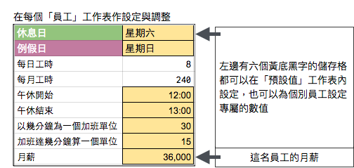
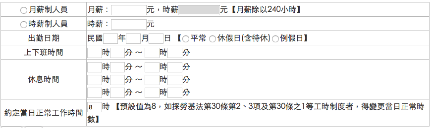

.. _hd7b751276e3b5a272340277219674:

加班費計算機使用手冊
********************

本計算機是利用Google試算表系統建立的一個計算加班費的試算表，以2016年12月立法院通過勞基法修正案為基礎。您輸入員工的月薪、公司的午休時間及該員工上下班時間等數值後，會計算出員工的加班費。

我們是一家化學防鏽劑製造與銷售的小公司。為了勞基法修法之後計算加班費而製作了一個試算表。後來發現周遭親友跟客戶中，很多中小企業對於加班費計算都有相同的困惑，於是決定做成這一個加班費計算機，把我們的心得分享出來，解決大家的困擾。

.. admonition:: 免責聲明

    本加班費計算機的內容及計算結果僅參考，使用加班費計算機時，代表您已經同意本計算機作者對您使用加班費計算機的結果不承擔任何責任，如不同意，請勿使用。

.. _h57574e4f5e306a1f6a391d2041155b23:

加班費計算機有什麼特性？
========================

與網路上其他試算機比較，本加班費計算機特點如下：

* 以實用為目的，可以具體每一個員工每一天的額外工資。

* 內建2017年行事曆，具體顯示該日性質是工作日、休息日還是例假日的資訊。但使用者仍可以自行設定。

* 所有計算規則、公式、過程資訊，您可以全部一覽無遺。

.. _h174fb648377959437b5c1f697c1c40:

名詞定義
========

為進行明確的計算，必須避免歧意，因此，除特別聲明外，以下列表格為本計算機及其文件整理出可能會有差異的名詞。請注意，這些名詞可能跟官方、媒體、社團等的用法不一樣。（詳見下方\ |LINK1|\ ？）

+--------+------------------------------------------------------------------------------------------------------------------------------------------------------------------------------------------------------------------------------------------------+
|名詞    |說明                                                                                                                                                                                                                                            |
+========+================================================================================================================================================================================================================================================+
|休息日  |與勞基法相同，每個禮拜一天由勞資雙方協議                                                                                                                                                                                                        |
+--------+------------------------------------------------------------------------------------------------------------------------------------------------------------------------------------------------------------------------------------------------+
|例假日  |與勞基法相同，每個禮拜一天由勞資雙方協議                                                                                                                                                                                                        |
+--------+------------------------------------------------------------------------------------------------------------------------------------------------------------------------------------------------------------------------------------------------+
|休假日  |在勞基法中國定假日（例如端午節）稱為「休假日」，因為計算加班費的方法與「例假日」相同，為了簡便起見，在本加班費計算機的「性質」欄位，顯示為「例假日」。                                                                                          |
+--------+------------------------------------------------------------------------------------------------------------------------------------------------------------------------------------------------------------------------------------------------+
|工作薪資|一律前八小時的酬勞為「工作薪資」。不論當日是工作日、休息日或是例假日，前八小時工資都不稱為「休息日加班費」或「例假日加班費」，避免與當日第九小時到第十二小時的加班費混淆。休息日或例假日的工作薪資及加班薪資都稱為「額外」，以跟「月薪」作區別。|
+--------+------------------------------------------------------------------------------------------------------------------------------------------------------------------------------------------------------------------------------------------------+
|加班薪資|一律稱後四小時（九到十二）的酬勞為「加班薪資」或「加班費」。例如，「休息日加班費」是指休息日後第九小時起的額外工資。                                                                                                                            |
+--------+------------------------------------------------------------------------------------------------------------------------------------------------------------------------------------------------------------------------------------------------+
|額外薪資|是指月薪之外的工作酬勞，凡是在「工作日的前八小時」之外的時間工作所獲得的額外酬勞。包括工作日加班，非工作日的前八小時或後四小時所得到的薪資，都稱為「額外」薪資。                                                                                |
+--------+------------------------------------------------------------------------------------------------------------------------------------------------------------------------------------------------------------------------------------------------+
|        |                                                                                                                                                                                                                                                |
+--------+------------------------------------------------------------------------------------------------------------------------------------------------------------------------------------------------------------------------------------------------+

.. _h174fb648377959437b5c1f697c1c40:

試算規則
========

如果比對網路上的資料，會發現很多互相衝突的說法，因此在使用前請詳閱本計算機採用的規則，確定本計算機的算法與您的算法是一樣的。

\ |IMG1|\ 

上面這張表是2016-12-20日版。每一個版本的加班費計算機檔案都有一個「規則」工作頁，請參照計算機上的版本。

..  Note:: 

    蒐集完整蒐集這張規則表並不容易，主要原因是資料之間用語模糊與衝突的情況不少，必須詳細推敲求證，我們並沒有十足的把握，這張表都是正確的。歡迎您指正。我們若有訂正，會更新計算公式發行新版。

.. _h572187820253c7294643631303029:

如何安裝？
==========

不需要下載與安裝，只要你有Googe帳號，點選以下連結，會開啟「加班費計算機的Google試算表」檔案之後，複製成為您自己的檔案即可開始使用。

+------------------+------------------+
|版本日期          |說明              |
+==================+==================+
|2017年12月20日版本|這是目前的最新版本|
+------------------+------------------+

.. _h572187820253c7294643631303029:

如何使用？
==========

#. 您複製一份加班費計算機的Google試算表到您的Google帳號之後，請開啟該檔案。

#. 到「預設值」工作表修改設定值符合公司的規定，例如午休時間與加班時間的認定。設定值的意義與設定方式在本工作表內有解說。

#. 複製「員工範本」工作表，並命名為「員工xxx」，就像「員工A」工作表那樣。

#. 設定員工xxx的資料符合該名員工的資訊，例如月薪

#. 根據日期輸入員工的上班與下班時間，即可在表上看到當日加班時間及當日的加班費。

#. 重複步驟3，繼續設定下一位員工的加班試算表。

\ |IMG2|\ 

\ |IMG3|\ 

.. _hd7b751276e3b5a272340277219674:

哪些儲存格可以編輯？
====================

為了方便使用，本計算機在需要您使用者輸入數值的儲存格，一律是黃底黑字。只要不是黃底黑字的地方，使用時您都可以不必作任何異動。

\ |IMG4|\ 

.. _h57574e4f5e306a1f6a391d2041155b23:

「員工」工作表的欄位意義
========================

請見各欄位的第一列註解，只要游標移到標題上方就會顯示。例如下圖所示為M欄「法定加班時數」的說明。

\ |IMG5|\ 

.. _h106d6a60386b4471802c17574203f54:

那些工作表是什麼作用？
======================

\ |IMG6|\ 

+----------+-------------------------------------------------------------------------------------------------------------------------------------------------------------------------------------------------------------------------------------------------------------------------------------------+
|工作表名稱|內容                                                                                                                                                                                                                                                                                       |
+==========+===========================================================================================================================================================================================================================================================================================+
|員工A     |每一個員工都有一個自己的工作表，這個工作表是從「員工範本」複製出來的，你可以從這個工作表開始輸入一個員工的設定資料與工作時數                                                                                                                                                               |
+----------+-------------------------------------------------------------------------------------------------------------------------------------------------------------------------------------------------------------------------------------------------------------------------------------------+
|員工範本  |這個工作表用來被複製出個別「員工」的工作表，例如「員工A」                                                                                                                                                                                                                                  |
+----------+-------------------------------------------------------------------------------------------------------------------------------------------------------------------------------------------------------------------------------------------------------------------------------------------+
|行事曆    |這個工作表用來設定國定假日，目前2017年的資料已經設定完成                                                                                                                                                                                                                                   |
+----------+-------------------------------------------------------------------------------------------------------------------------------------------------------------------------------------------------------------------------------------------------------------------------------------------+
|預設值    |從「員工範本」複製的「員工X」工作表的A欄與B欄的數值會與這個工作表的數值相同。「員工X」工作表當中可以作修改，請注意，修改之後就不會再與這個工作表的內容同步了。如果你仍保持「預設值」與「員工X」工作表之間的連動關係，修改預設值會修改員工工作表上的設定值。是否保持同步，請依個人需要調整。|
+----------+-------------------------------------------------------------------------------------------------------------------------------------------------------------------------------------------------------------------------------------------------------------------------------------------+
|規則      |說明這一版本的加班費計算機所根據的計算規則                                                                                                                                                                                                                                                 |
+----------+-------------------------------------------------------------------------------------------------------------------------------------------------------------------------------------------------------------------------------------------------------------------------------------------+
|讀我      |希望你讀在這個工作表內的訊息                                                                                                                                                                                                                                                               |
+----------+-------------------------------------------------------------------------------------------------------------------------------------------------------------------------------------------------------------------------------------------------------------------------------------------+

.. _h572187820253c7294643631303029:

如何設定？
==========

所有設定的方式都在試算表儲存格註解上有說明。

有一個值得特別說明的地方是「加班不滿一小時算一小時」這個說法到底是否成立的問題。按照字面意義，多一分鐘也算一小時，這顯然有違常理。我們也找不到法律是否有強制性規定的資料。有的公司是以一小時為一個計算單位，有個公司則是以三十分鐘為一個計算單位，那麼加班幾分鐘可以多久算一個單位呢？在本計算機中讓您可以根據公司的情況自行設定。例如：

如果設定是這樣：

\ |IMG7|\  

計算案例：

+----------+-------------------------------------------------------------+
|加班34分鐘|視為30分鐘，因為34-30＝4沒有超過15分鐘                       |
+----------+-------------------------------------------------------------+
|加班46分鐘|視為60分鐘，因為46-30＝16超過15分鐘，視同30分鐘，總計60分鐘。|
+----------+-------------------------------------------------------------+

如果設定是這樣：

\ |IMG8|\ 

計算案例：

+----------+-----------------------------------+
|加班34分鐘|視為60分鐘，因為超過1分鐘算60分鐘  |
+----------+-----------------------------------+
|加班61分鐘|視為120分鐘，因為第61分鐘算60分鐘。|
+----------+-----------------------------------+

.. _h57574e4f5e306a1f6a391d2041155b23:

如何幫助讓本計算機更好？
========================

* 在法律沒有強制規定的地方（或許有，只是我們不知道），本計算機暫行先自行決定計算方式細節（例如四捨五入問題）。由於本計算機已經毫無保留把所有的計算公式都放在Spreadsheet裡面，沒有任何回傳後台私有伺服器進行的運算，您完全可以自行修改成您所喜歡的計算公式。

* 回報問題，我們歡迎任何指正與建議。但我們無法保證一定會在很短的時間內完成，也無法保證完全依照您的要求修訂，我們會在不影響公司運作的情況下，維持本計算機能算出正確的結果。

* 如果您覺得加班費計算機對您有幫助，也請您幫助我們將\ |LINK2|\ 轉告貴公司的總務。這樣一來我們在製作加班費計算機時就感覺也是在替公司做事。\ |IMG9|\ 

.. _h68017771fa7c85ef23567fe7b5a:

如何回報問題？
==============

本計算機的目的在解決問題。透過明確計算出數字的方式，確認對於法令內容有正確的理解，避免因不了解法令而計算錯誤產生各式各樣的糾紛與困擾。然而，由於本公司是化學防鏽劑製造公司，不是法律事務所，也不是官方機構，在蒐集資料與法令解釋上容有疏失之處，敬請理解。

如果您發現本計算機有計算錯誤與誤解法令的地方，可以改正本計算機的計算結果跟法令相符合，非常歡迎您告訴我們。請利用以下的方式：

* 一般性的意見與回饋，請利用\ |LINK3|\ 。這是我司人員經常會看的網頁，為降低作業負擔，請恕不另開設專頁。如果您不想公開留言，請使用私訊。

* 技術性的，特別是跟試算機功能、BUG有關的議題，請利用\ |LINK4|\ 。您可在輸入Issue時使用中文。

.. _h68017771fa7c85ef23567fe7b5a:

如何更新版本？
==============

請經常回來本文件，參考上面「如何安裝」一節當中的「最新版本」並與您複製的版本相對照。目前沒有其他更方便的作法。

.. _bookmark-id-3hs6hcmo7yiy:

為什麼要使用這樣的稱法？
========================

很多媒體跟網路上的資料都在講「加班費」該怎麼算，可是越看越糊塗，問題關鍵在於「加班費」有兩種意義被混淆，例如，資料上都把星期六到公司上班的工資稱為「加班費」，那麼要怎麼稱呼「在星期六工作八小時之後的繼續工作」？「加班的加班費」是嗎？這情況在語言上講不清楚，資料也就很難找，也很容易雞同鴨講。所以為了釐清差異，本計算機決定用一種不會產生混淆的方式來稱呼。

前八小時一律稱為「工作」，後四小時一律稱為「加班」。所以星期六上班的工資，稱為「例假日上班工資」或者「休息日上班工資」，因為星期六算休息日或例假日是二擇一，因人而異，總之，前八小時工資都叫做上班工資。只有把後四小時稱為「加班工資」。這樣才不會顯得資訊很混亂，避免無謂的爭論。

還有一種混淆是來自語意不清，以時薪150元的員工為例，休息日前八小時加班費到底是1588元還是588元呢？兩種講法都可能出現，要看講的人是否把當日基本薪資1000算入「加班費」。為了避免這種混淆，本計算機以「額外」來作區隔。凡是月薪之外的所得，都稱為「額外」。

那麼勞基法怎麼說呢？勞基法上稱為「延長工時」，因為不是使用日常用語，如果看勞委會的法令解釋，我們這種門外漢恐怕只會越看越不知所云，所以本計算機不採用正式的法律用語。

.. _h174fb648377959437b5c1f697c1c40:

參考資料
========

這裡所列的是我們製作本計算機過程中透過Google搜尋得到的網頁資料及研讀後的註記。搜尋日期約在2016年12月9到日16日之間。

+------------------------------+------------------------------------------------------------------------------------------------------------------------------------------------------------------------------------------------------------------------------------------------------------------------------------------------------------+
|連結                          |備註                                                                                                                                                                                                                                                                                                        |
+==============================+============================================================================================================================================================================================================================================================================================================+
|\ |LINK5|\                    |                                                                                                                                                                                                                                                                                                            |
+------------------------------+------------------------------------------------------------------------------------------------------------------------------------------------------------------------------------------------------------------------------------------------------------------------------------------------------------+
|\ |LINK6|\                    |這個系統上使用的詞彙是「週休二日」而不是「一例一休」這種常見的說法。目前關於休息日工資算法有很多講法，本計算機以此網站為準。因為這個網站使用「額外工資」的文字，感覺比較明確。                                                                                                                              |
|                              |                                                                                                                                                                                                                                                                                                            |
|                              |這個試算機的問題是有點簡要，似乎主要是為了宣導用途，\ |LINK7|\ 。細節問題無法透過這個試算機得到解答。例如，超時1分鐘算1小時嗎？不滿一小時，是否算一小時呢？                                                                                                                                                 |
|                              |                                                                                                                                                                                                                                                                                                            |
|                              |2016年12月16日更新：本日勞動部推出新的版本。從三個版本比較改成兩個版本，原來「週休二日」已經改成「現成版本」，前一版本的混淆問題已經有所改善。但仍屬於比較性質。                                                                                                                                            |
+------------------------------+------------------------------------------------------------------------------------------------------------------------------------------------------------------------------------------------------------------------------------------------------------------------------------------------------------+
|\ |LINK8|\                    |這系統提供三種類型：平常、 休假日(含特休)、例假日。然而沒有「休息日」，而且把特休算為「休假日」，休假日在新制中算是「例假日」。這不禁令人疑惑，到底休假日是不是例假日，如果不一樣，特休算哪一種，光是在這個地方我們越看越混淆。（附圖二）                                                                   |
|                              |                                                                                                                                                                                                                                                                                                            |
|                              |我們以月薪3600，2016/12/10星期六工作八小時為例， 休假日(含特休)、例假日兩種項目，算出來的都是1200。跟勞動部試算比較，不是「週休二日（一例一休）」也不是「舊制」而是沒通過的「兩例假草案」一樣。                                                                                                             |
|                              |                                                                                                                                                                                                                                                                                                            |
|                              |不知道到底這個試算系統是哪一制，或者台中市有自己的規定？                                                                                                                                                                                                                                                    |
+------------------------------+------------------------------------------------------------------------------------------------------------------------------------------------------------------------------------------------------------------------------------------------------------------------------------------------------------+
|\ |LINK9|\                    |與台中市政府勞動局提供的試算機似乎是同一版本（附圖二）。問題相同。                                                                                                                                                                                                                                          |
|                              |                                                                                                                                                                                                                                                                                                            |
|                              |但是，台北市政府的版本比台中市政府版本多一個中秋節的範例（附圖三），使用的算法是「例假日」的算法，在這裡我們看到一個「例假日加班」的案例，以此案例並沒有力安會計師事務所所說的「兩倍」。到底這個計算器沒有更新，還是力安會計師事務所弄錯了呢，不可得知。                                                    |
|                              |                                                                                                                                                                                                                                                                                                            |
|                              |2016年12月16日更新：以勞動部的新試算系統為準，確認例假日加班兩倍時薪的作法才是正確的，也就是說力安會計師事務的網頁算法是對的。那麼對於台北市政府的中秋節試算案例，有兩種可能的情況，（一）台北市勞動局的試算案例是錯誤的，或者，（二）表示我們對於計算工資時「國定假日＝休假日＝例假日」的認知是錯誤的。    |
+------------------------------+------------------------------------------------------------------------------------------------------------------------------------------------------------------------------------------------------------------------------------------------------------------------------------------------------------+
|\ |LINK10|\                   |報導上說「休息日只要徵得勞工同意就可上班；不過僱主須付加班費，除原本工資外，加班頭2小時各可再獲1又1/3（即4/3）加班費，2小時之後可獲得1又2/3（即5/3）加班費，且一次至少發給4小時，不滿1小時也要發4小時，等於若勞工休息日加班1小時，可獲6小時加班費。」                                                       |
|                              |                                                                                                                                                                                                                                                                                                            |
|                              |六倍怎麼算出來的內文沒講？猜是指當天只做五個小時的話，第五小時雖然只有一小時，要算四小時，於是效益是 5/3 \* 4 = 6.67。                                                                                                                                                                                      |
|                              |                                                                                                                                                                                                                                                                                                            |
|                              |在這篇報導後面有休息日加班的試算，表示新制加班費是1900，比舊制700為優。按其文意，1900尚不包括當日薪資1200。換言之，當日總所得為3100。這一講法又跟力安會計師事務所的算法發生衝突。                                                                                                                           |
+------------------------------+------------------------------------------------------------------------------------------------------------------------------------------------------------------------------------------------------------------------------------------------------------------------------------------------------------+
|\ |LINK11|\ (Now News)        |這篇報導出現休息日加班不足12小時算12小時的說法，但沒說休假日與例假日比照辦理。                                                                                                                                                                                                                              |
|                              |                                                                                                                                                                                                                                                                                                            |
|                              |2016年12月15日更新：根據報導，蔣萬興立法委員追問勞動部關於休息日加班費的計算問題，勞動部確認「加班不足12小時算12小時的說法」正確。這篇報導是我們所蒐集的資料中事前唯一有這項報導的媒體。                                                                                                                    |
+------------------------------+------------------------------------------------------------------------------------------------------------------------------------------------------------------------------------------------------------------------------------------------------------------------------------------------------------+
|\ |LINK12|\ (力安會計師事務所)|休息日工作時段薪資怎麼算？這篇的算法是不包括當日工資，因為當日工資已經包含在月薪中。但是這一說法與蘋果日報的報導及勞動部的試算機相衝突。                                                                                                                                                                    |
|                              |                                                                                                                                                                                                                                                                                                            |
|                              |例假日加班薪資怎麼算？這篇的算法（在示範案例中）是工時的兩倍，而不是平常工作日的4/3。這跟冰與火的世界部落格上引用的勞動部解釋函說法不一樣。                                                                                                                                                                 |
|                              |                                                                                                                                                                                                                                                                                                            |
|                              |2016年12月16日更新：以勞動部的新試算系統為準，確認例假日加班兩倍時薪的作法才是正確的。                                                                                                                                                                                                                      |
+------------------------------+------------------------------------------------------------------------------------------------------------------------------------------------------------------------------------------------------------------------------------------------------------------------------------------------------------+
|\ |LINK13|\                   |例假日（內文舉端午節為例）加班薪資怎麼算？這篇的算法與平常工作日相同。與力安會計師事務所的算法不同。內文引用「行政院勞工委員會87年9月14日台(87)勞動二字第39675號函」，說明例假日超過八小時部分比照勞基法24條，本計算機目前採用這種算法。不過這篇文章中有個小問題是案例的加總算錯了，應該是2167，而不是2267。|
+------------------------------+------------------------------------------------------------------------------------------------------------------------------------------------------------------------------------------------------------------------------------------------------------------------------------------------------------+
|\ |LINK14|\                   |跟蘋果日報的內容雷同，但更簡略。                                                                                                                                                                                                                                                                            |
+------------------------------+------------------------------------------------------------------------------------------------------------------------------------------------------------------------------------------------------------------------------------------------------------------------------------------------------------+
|\ |LINK15|\                   |這系統沒有列出發問跟回答的時間，由於法律條文是有時間性的，我們無法從這網頁資料找到參考價值的資訊。                                                                                                                                                                                                          |
+------------------------------+------------------------------------------------------------------------------------------------------------------------------------------------------------------------------------------------------------------------------------------------------------------------------------------------------------+
|\ |LINK16|\ （東森新聞）      |我們覺得這則報導是媒體報導中比較詳細的，至少有張圖表。本則報導關於休息日的算法也是採取額外再增加一日薪的版本，與勞動部試算機相同，而與力安會計師事務所的版本不一樣。                                                                                                                                        |
+------------------------------+------------------------------------------------------------------------------------------------------------------------------------------------------------------------------------------------------------------------------------------------------------------------------------------------------------+
|\ |LINK17|\                   |在這則新聞中，關於休息日的工資採取的也是多數的看法，只是顯然把「休假日」與「休息日」搞混了。題目中的休假日應該是休息日。                                                                                                                                                                                    |
+------------------------------+------------------------------------------------------------------------------------------------------------------------------------------------------------------------------------------------------------------------------------------------------------------------------------------------------------+
|\ |LINK18|\                   |在這篇報導中出現一個別人沒有的「輪休日」，但又括號「現行規定」，意思似乎是與新制不同可以忽略。可是，算法跟「勞工新制下之加班費計算」力安會計師事務所的版本相同。到底是怎麼回事？不知道，有點困惑。                                                                                                          |
+------------------------------+------------------------------------------------------------------------------------------------------------------------------------------------------------------------------------------------------------------------------------------------------------------------------------------------------------+
|\ |LINK19|\                   |這篇報導跟上則自由時報的報導各有一張圖表，這兩張算是比較清楚明確的圖表。                                                                                                                                                                                                                                    |
+------------------------------+------------------------------------------------------------------------------------------------------------------------------------------------------------------------------------------------------------------------------------------------------------------------------------------------------------+
|\ |LINK20|\                   |「加班不滿一小時到底要不要算一小時？」這個問題仍無明確資料，這則連結是公務員的算法，照此要點公務員是一律不算（支給標準第二點）。                                                                                                                                                                            |
+------------------------------+------------------------------------------------------------------------------------------------------------------------------------------------------------------------------------------------------------------------------------------------------------------------------------------------------------+
|\ |LINK21|\ （中國時報）      |關於休息日加班的計算方式，12月15日終於有比較明確的報導，根據報導，勞動部確實認為休息日加班不滿12小時應算12小時。                                                                                                                                                                                            |
+------------------------------+------------------------------------------------------------------------------------------------------------------------------------------------------------------------------------------------------------------------------------------------------------------------------------------------------------+

附圖一：力安會計師事務所例假日加班的算法(這是正確的例假日算法）

\ |IMG10|\ 

附圖二：台北市與台中市政府勞工局提供，有點令人疑惑的試算表（沒有休息日的算法）。

\ |IMG11|\ 

附圖三：台北市政府例假日加班的範例（有點令人疑惑的範例）

\ |IMG12|\ 

附圖四：與圖三相同的薪資，勞動部的試算系統試算結果是1,540

\ |IMG13|\ 

.. bottom of content

.. |LINK1| raw:: html

    <a href="#bookmark-id-3hs6hcmo7yiy">為什麼要使用這樣的稱法</a>

.. |LINK2| raw:: html

    <a href="https://goo.gl/TLq35w" target="_blank">公司的產品資訊</a>

.. |LINK3| raw:: html

    <a href="https://www.facebook.com/neusauber" target="_blank">本公司的FB粉絲頁</a>

.. |LINK4| raw:: html

    <a href="https://github.com/rexiap/neusauber/issues" target="_blank">本計算機在Github上的Issue Tracker</a>

.. |LINK5| raw:: html

    <a href="http://law.moj.gov.tw/LawClass/LawAll.aspx?PCode=N0030001" target="_blank">勞基法</a>

.. |LINK6| raw:: html

    <a href="http://labweb.mol.gov.tw/index_2.html#monthlyPay=36000&regularDayOffWorkReason=disaster&workhours=8%2C8%2C8%2C8%2C8%2C8%2C0" target="_blank">勞動部試算系統</a>

.. |LINK7| raw:: html

    <a href="http://www.cna.com.tw/news/firstnews/201607210047-1.aspx" target="_blank">根據報導這個試算機是從gov改過來的</a>

.. |LINK8| raw:: html

    <a href="http://www.labor.taichung.gov.tw/sp.asp?xdurl=superXD/labor/overTimePayCalculate.asp&ctNode=3945&mp=117010&icuitem=1376995" target="_blank">台中市政府勞動局提供的試算</a>

.. |LINK9| raw:: html

    <a href="http://web2.bola.taipei/cutweb/a2.asp" target="_blank">台北市政府勞動局提供的試算</a>

.. |LINK10| raw:: html

    <a href="http://www.appledaily.com.tw/appledaily/article/headline/20160629/37287841/" target="_blank">休息日加班 最高1小時領6倍薪（蘋果日報）</a>

.. |LINK11| raw:: html

    <a href="http://www.nownews.com/n/2016/06/29/2151374" target="_blank">行政院擬新制　一例一休加班費這樣算</a>

.. |LINK12| raw:: html

    <a href="http://eehscpafirm.com/practical-analysis/75..." target="_blank">勞工新制下之加班費計算</a>

.. |LINK13| raw:: html

    <a href="http://53973000.blogspot.tw/2014/12/blog-post_11.html" target="_blank">冰與火的世界部落格</a>

.. |LINK14| raw:: html

    <a href="http://news.tvbs.com.tw/politics/661360" target="_blank">一例一休加班費大躍進！做1小時可領6小時薪水（TVBS）</a>

.. |LINK15| raw:: html

    <a href="https://tw.answers.yahoo.com/question/index?qid=20071026000010KK02166" target="_blank">加班未滿1小時要怎麼計算薪資?(Yahoo 知識+)</a>

.. |LINK16| raw:: html

    <a href="http://news.ebc.net.tw/news.php?nid=45008" target="_blank">「一例一休」加班費怎麼算？一張圖告訴你</a>

.. |LINK17| raw:: html

    <a href="http://a.udn.com/focus/2016/07/10/23032/index.html" target="_blank">5題讓你搞懂「一例一休」在談什麼（聯合報）</a>

.. |LINK18| raw:: html

    <a href="http://news.ltn.com.tw/photo/focus/paper/695944" target="_blank">新版加班費有4種 後遺症不少（自由時報）</a>

.. |LINK19| raw:: html

    <a href="http://www.setn.com/News.aspx?NewsID=205649" target="_blank">勞工必看！「一例一休」4種加班費怎麼算（三立新聞）</a>

.. |LINK20| raw:: html

    <a href="http://weblaw.exam.gov.tw/LawArticle.aspx?LawID=J060242004" target="_blank">行政院人事行政總處加班及加班費支給要點(103/3/23)</a>

.. |LINK21| raw:: html

    <a href="http://www.chinatimes.com/realtimenews/20161215003054-260405" target="_blank">休息日第9小時加班費？ 勞動部：不加發時薪</a>

.. |IMG6| image:: static/overtimepaycal_6.png
   :height: 44 px
   :width: 476 px

.. |IMG7| image:: static/overtimepaycal_7.png
   :height: 44 px
   :width: 264 px

.. |IMG8| image:: static/overtimepaycal_8.png
   :height: 45 px
   :width: 260 px

.. |IMG9| image:: static/overtimepaycal_9.png
   :height: 44 px
   :width: 52 px

.. |IMG10| image:: static/overtimepaycal_10.png
   :height: 58 px
   :width: 697 px

.. |IMG12| image:: static/overtimepaycal_12.png
   :height: 185 px
   :width: 697 px

