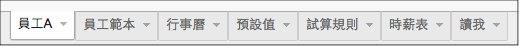
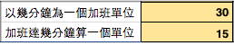
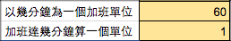

.. _h57574e4f5e306a1f6a391d2041155b23:

一例一休新制加班費計算機
************************

.. _h174fb648377959437b5c1f697c1c40:

使用手冊
********

本計算機計算「一例一休」修法後的加班費，有手機與桌機兩種版本。手機版本適合用於計算單日的加班費。「桌機或筆電」版本是一個Google的試算表，適合用於大螢幕，這一版本是專為人力資源部門或會計部門等專業人員使用而設計，可用於計算多人多日的加班費。輸入員工的月薪、公司的午休時間及該員工上下班時間等數值後，可以計算出員工每一天的加班費。

.. 免責聲明:: 

    本加班費計算機的內容及計算結果僅參考，使用加班費計算機時，代表您已經同意本計算機作者對您使用加班費計算機的結果不承擔任何責任，如不同意，請勿使用。

.. _hd1b83d48586e1b393a624e28544946:

手機版
======

+-----------+------------------------------------------------+
|版本       |說明                                            |
+===========+================================================+
|\ |LINK1|\ |直接點選連結開啟後即可使用。這是目前的最新版本。|
+-----------+------------------------------------------------+

.. _hd1b83d48586e1b393a624e28544946:

桌機板
======

.. _h56a41143b2a3f40427e7a356617232:

第一步：滑鼠點一下開啟加班費計算機
----------------------------------

不需要下載任何檔案，只需要Googe帳號，請點選以下最新版本的連結，會在瀏覽器上開啟「加班費計算機的Google試算表」檔案的新頁面。

+-----------+------------------+
|版本       |說明              |
+===========+==================+
|\ |LINK2|\ |這是目前的最新版本|
+-----------+------------------+

.. _h561058696e791d485b51f6c4d211a3b:

第二步：滑鼠再點一下建立副本就OK了
----------------------------------

請開在「加班費計算機」檔案的瀏覽器頁面上，到「檔案(File)」下拉選單上點選「建立副本(make a copy)」。並且在跳出的確認視窗（如下圖）上點選「確定」，便可複製一份屬於您自己的「加班費計算機」Google試算表到您的Google雲端硬碟上，您使用這個新副本。（資料夾可以任意選擇，而且不必勾選「與相同協作者共用」）

\ |IMG1|\ 

（以下內容說明桌機專業用版）

.. _h65a754d314849631d4f1770f68746b:

本加班費計算機有什麼特性？
==========================

我們\ |LINK3|\ 是一家化學防鏽劑製造與銷售的小公司。為了勞基法修法之後計算加班費而製作了一個試算表。後來發現周遭親友跟客戶中，很多中小企業對於加班費計算都有相同的困惑，於是決定做成這一個加班費計算機，把我們的心得分享出來，協助大家解決困擾。

與網路上其他試算機比較，本加班費計算機特點如下：

* 可具體計算每位員工每一天的額外加班工資。
* 內建2017年行事曆，清楚顯示每日工作性質類別。也讓使用者可以自行修改設定。
* 所有計算規則、公式、過程資訊，都可以全部一覽無遺。由於法令的理解可能不同，以及公司可以優於勞基法，您可能有不同的計算公式。本計算機以開放程式碼Open Source及MIT授權的方式釋出，您可以自行修改計算公式以適用於您的需求。

.. _h174fb648377959437b5c1f697c1c40:

名詞定義
========

為進行明確的計算，必須避免歧意，因此，除特別聲明外，以下列表格為本計算機及其文件整理出可能會有差異的名詞。請注意，這些名詞可能跟官方、媒體、社團等的用法不一樣。（詳見下方「為什麼要改變網路資料上對「加班」的用法」）

+--------+------------------------------------------------------------------------------------------------------------------------------------------------------------------------------------------------------------------------------------------------+
|名詞    |說明                                                                                                                                                                                                                                            |
+========+================================================================================================================================================================================================================================================+
|休息日  |與勞基法相同，每個禮拜一天由勞資雙方協議                                                                                                                                                                                                        |
+--------+------------------------------------------------------------------------------------------------------------------------------------------------------------------------------------------------------------------------------------------------+
|例假日  |與勞基法相同，每個禮拜一天由勞資雙方協議                                                                                                                                                                                                        |
+--------+------------------------------------------------------------------------------------------------------------------------------------------------------------------------------------------------------------------------------------------------+
|休假日  |在勞基法中國定假日（例如端午節）稱為「休假日」，因為計算加班費的方法與「例假日」相同，為了簡便起見，在本加班費計算機的「性質」欄位，顯示為「例假日」。                                                                                          |
+--------+------------------------------------------------------------------------------------------------------------------------------------------------------------------------------------------------------------------------------------------------+
|工作薪資|一律前八小時的酬勞為「工作薪資」。不論當日是工作日、休息日或是例假日，前八小時工資都不稱為「休息日加班費」或「例假日加班費」，避免與當日第九小時到第十二小時的加班費混淆。休息日或例假日的工作薪資及加班薪資都稱為「額外」，以跟「月薪」作區別。|
+--------+------------------------------------------------------------------------------------------------------------------------------------------------------------------------------------------------------------------------------------------------+
|加班薪資|一律稱後四小時（九到十二）的酬勞為「加班薪資」或「加班費」。例如，「休息日加班費」是指休息日後第九小時起的額外工資。                                                                                                                            |
+--------+------------------------------------------------------------------------------------------------------------------------------------------------------------------------------------------------------------------------------------------------+
|額外薪資|是指月薪之外的工作酬勞，凡是在「工作日的前八小時」之外的時間工作所獲得的額外酬勞。包括工作日加班，非工作日的前八小時或後四小時所得到的薪資，都稱為「額外」薪資。                                                                                |
+--------+------------------------------------------------------------------------------------------------------------------------------------------------------------------------------------------------------------------------------------------------+

.. _h174fb648377959437b5c1f697c1c40:

試算規則
========

如果比對網路上的資料，會發現很多互相衝突的說法，因此在使用前請詳閱本計算機採用的規則，確定本計算機的算法與您的算法是一樣的。

\ |IMG2|\ 

上面這張表圖2016-12-22日C版的截圖。原始版本在加班費計算機試算表上。

.. Note:: 

    2016年12月22日C版是以蘋果日報同日報導的計算方式為依據。在製作過程中，我們發現資料之間用語模糊與衝突的情況不少，我們沒有充分證據確認蘋果日報這張表與勞動部或勞檢單位的認知相符合。如果您有可靠的官方資料，歡迎您指正。若有訂正，會更新計算公式發行新版。

.. _h572187820253c7294643631303029:

如何使用？
==========

#. 您複製一份加班費計算機的Google試算表到您自己的雲端硬碟之後，請開啟該屬於您自己的加班費計算機檔案。
#. 到「預設值」工作表修改設定值符合公司的規定，例如午休時間與加班時間的認定。設定值的意義與設定方式在本工作表內有解說。
#. 複製「員工範本」工作表，並命名為「員工xxx」，就像「員工A」工作表所示範的那樣。
#. 設定員工xxx的資料符合該名員工的資訊，例如該名員工的月薪。
#. 根據日期輸入員工的上班與下班時間，即可在表上看到當日加班時間及當日的加班費。
#. 重複步驟3，繼續設定下一位員工的加班試算表。

\ |IMG3|\ 

\ |IMG4|\ 

.. _h57574e4f5e306a1f6a391d2041155b23:

哪些儲存格需要輸入數值？
========================

為了方便使用，本計算機在需要您使用者輸入數值的儲存格，一律是黃底黑字。只要不是黃底黑字的地方，使用時您都可以不必作任何異動。

\ |IMG5|\ 

.. _h57574e4f5e306a1f6a391d2041155b23:

「員工」工作表的欄位意義
========================

請見「員工工作表」上第一列上各欄位的註解，只要游標移到標題上方就會顯示。例如下圖所示為M欄「法定加班時數」的說明。

\ |IMG6|\ 

.. _h106d6a60386b4471802c17574203f54:

各個工作表的內容與用途
======================

\ |IMG7|\ 

+----------+-------------------------------------------------------------------------------------------------------------------------------------------------------------------------------------------------------------------------------------------------------------------------------------------+
|工作表名稱|內容                                                                                                                                                                                                                                                                                       |
+==========+===========================================================================================================================================================================================================================================================================================+
|員工A     |每一個員工都有一個自己的工作表，這個工作表是從「員工範本」複製出來的，你可以從這個工作表開始輸入一個員工的設定資料與工作時數                                                                                                                                                               |
+----------+-------------------------------------------------------------------------------------------------------------------------------------------------------------------------------------------------------------------------------------------------------------------------------------------+
|員工範本  |這個工作表用來被複製出個別「員工」的工作表，例如「員工A」                                                                                                                                                                                                                                  |
+----------+-------------------------------------------------------------------------------------------------------------------------------------------------------------------------------------------------------------------------------------------------------------------------------------------+
|行事曆    |這個工作表用來設定國定假日，目前2017年的資料已經設定完成                                                                                                                                                                                                                                   |
+----------+-------------------------------------------------------------------------------------------------------------------------------------------------------------------------------------------------------------------------------------------------------------------------------------------+
|預設值    |從「員工範本」複製的「員工X」工作表的A欄與B欄的數值會與這個工作表的數值相同。「員工X」工作表當中可以作修改，請注意，修改之後就不會再與這個工作表的內容同步了。如果你仍保持「預設值」與「員工X」工作表之間的連動關係，修改預設值會修改員工工作表上的設定值。是否保持同步，請依個人需要調整。|
+----------+-------------------------------------------------------------------------------------------------------------------------------------------------------------------------------------------------------------------------------------------------------------------------------------------+
|試算規則  |說明這一版本的加班費計算機所根據的計算規則                                                                                                                                                                                                                                                 |
+----------+-------------------------------------------------------------------------------------------------------------------------------------------------------------------------------------------------------------------------------------------------------------------------------------------+
|時薪表    |可輸入月薪產生該月薪的四種性質各十二小時的詳細時薪表                                                                                                                                                                                                                                       |
+----------+-------------------------------------------------------------------------------------------------------------------------------------------------------------------------------------------------------------------------------------------------------------------------------------------+
|讀我      |希望你讀在這個工作表內的訊息                                                                                                                                                                                                                                                               |
+----------+-------------------------------------------------------------------------------------------------------------------------------------------------------------------------------------------------------------------------------------------------------------------------------------------+

.. _h507524361a55b2f195d763e73767f36:

如何設定預設值？
================

所有可以設定的儲存格的設定方式都在試算表儲存格註解上會作說明。如果有說明不詳細的地方，歡迎告訴我們改進。

.. _h6a54293d7e5e2869d6d657639102828:

「加班不滿一小時算一小時」怎麼設定？
------------------------------------

有一個值得特別說明的地方是「加班不滿一小時算一小時」這個說法到底是否成立的問題。按照字面意義，多一分鐘也算一小時，這顯然有違常理。我們也找不到法律是否有強制性規定的資料。有的公司是以一小時為一個計算單位，有個公司則是以三十分鐘為一個計算單位，那麼加班幾分鐘可以多久算一個單位呢？在本計算機中讓您可以根據公司的情況自行設定。例如：

如果設定是這樣：

\ |IMG8|\ 

計算案例：

+----------+-------------------------------------------------------------+
|加班34分鐘|視為30分鐘，因為34-30＝4沒有超過15分鐘                       |
+----------+-------------------------------------------------------------+
|加班46分鐘|視為60分鐘，因為46-30＝16超過15分鐘，視同30分鐘，總計60分鐘。|
+----------+-------------------------------------------------------------+

如果設定是這樣，亦即無條件進位：

\ |IMG9|\ 

計算案例：

+------------------+----------------------------------+
|加班34分鐘        |視為60分鐘，因為超過1分鐘算60分鐘 |
+------------------+----------------------------------+
|加班一小時又一分鐘|視為兩小時，因為第61分鐘算60分鐘。|
+------------------+----------------------------------+

如果是這樣，亦即無條件捨去：

\ |IMG10|\ 

計算案例：

+----------------------+--------------+
|加班三十四分鐘        |視為無加班    |
+----------------------+--------------+
|加班一小時又五十九分鐘|視為加班一小時|
+----------------------+--------------+

.. _h65a754d314849631d4f1770f68746b:

如何幫助讓本計算機更好用？
==========================

* 在法律沒有強制規定的地方（或許有，只是我們不知道），本計算機暫行先自行決定計算方式細節（例如四捨五入問題）。由於本計算機已經毫無保留把所有的計算公式都放在Spreadsheet裡面，沒有任何回傳後台私有伺服器進行的運算，您完全可以自行修改成您所喜歡的計算公式。
* 我們歡迎任何指正與建議。然而，我們無法保證一定會在很短的時間內完成，也無法保證完全依照您的要求修訂，因為我們必須在不影響公司原有運作的情況下投入人力進行本計算機的維護。
* 如果您覺得加班費計算機對您有幫助，\ |LINK4|\ 。這樣我們在製作加班費計算機時會感覺也是在替公司做事，會更努力把這個計算機做的更好。\ |IMG11|\ 

.. _h68017771fa7c85ef23567fe7b5a:

如何回報問題？
==============

如果您發現本計算機有計算錯誤與誤解法令的地方，可以改正本計算機的計算結果跟法令相符合，歡迎您讓我們知道。請利用以下的方式：

* 一般性的意見與回饋，請利用\ |LINK5|\ 。這是公司人員經常會看的網頁，為降低作業負擔，請恕不另開設專頁。如果您不想公開留言，也可以使用私訊。
* 技術性的議題，例如與試算機功能、BUG有關的議題，也可利用\ |LINK6|\ 。您可在輸入Issue時使用中文或英文。

本公司與法律事務所及官方機構皆無關聯，在蒐集資料與法令解釋上容有疏失之處，感謝您的理解與幫助。

.. _h68017771fa7c85ef23567fe7b5a:

如何更新版本？
==============

請經常回來本文件，參考上面「如何安裝」一節當中的「最新版本」並與您複製的版本相對照。目前沒有其他更方便的作法。

.. _h417737732f18171e7b3f2567d12025:

為什麼要改變網路資料上對「加班」的用法
======================================

很多媒體跟網路上的資料都在講「加班費」該怎麼算，可是越看越糊塗，問題關鍵在於「加班費」有兩種意義被混淆，例如，資料上都把星期六到公司上班的工資稱為「加班費」，那麼要怎麼稱呼「在星期六工作八小時之後的繼續工作」？「加班的加班費」是嗎？這情況在語言上講不清楚，資料也就很難找，也很容易變成雞同鴨講。所以為了釐清概念，本計算機決定用一種不會產生混淆的方式來稱呼。

前八小時一律稱為「工作」，後四小時一律稱為「加班」。所以星期六上班的工資，稱為「例假日上班工資」或者「休息日上班工資」，因為星期六算休息日或例假日是二擇一，因人而異，總之，前八小時工資都叫做上班工資。只有把後四小時稱為「加班工資」。這樣才不會顯得資訊很混亂，避免無謂的爭論。

還有一種混淆是來自語意不清，以時薪150元的員工為例，休息日前八小時加班費到底是1588元還是588元呢？兩種講法都可能出現，要看講的人是否把當日基本底薪1000元算入「加班費」。為了避免這種混淆，本計算機以「額外」來作區隔。凡是月薪之外的所得，都稱為「額外」。

那麼勞基法怎麼說呢？勞基法上用「延長工時」這種名詞，到底「延長工時」跟日常用語「加班」是否一模一樣？這很難講，我們不敢確定（如果一樣，為何不直接用「加班」？）。因為不是使用日常用語，如果用法律名稱，像我們這種門外漢恐怕只會越看越不知所云，所以本計算機不採用正式的法律用語（事實上我們也沒能找到資料，可以知道法律上對於前面所說的各種「加班費」的用詞與語意混亂上有什麼決定性的用法）。

.. _h174fb648377959437b5c1f697c1c40:

參考資料
========

這裡所列的是我們製作本計算機過程中透過Google搜尋得到的網頁資料及研讀後的註記。搜尋日期約在2016年12月9到日16日之間。(也許我們在備註描述文字上有點哀怨，我們非常感謝這些網路資料所有的提供者，雖然資料或許有些令我們疑惑之處，然而如果沒有這些資料，我們無法拼湊出更接近全貌的認知以完成這個加班費計算機)

+------------------------------+----------------------------------------------------------------------------------------------------------------------------------------------------------------------------------------------------------------------------------------------------------------------------------------------------------------------------------------------------------------------------------------------------------------------------------------------------------------------------------------------------------------------------------------------------------------------------------------------------------+
|連結                          |備註                                                                                                                                                                                                                                                                                                                                                                                                                                                                                                                                                                                                      |
+==============================+==========================================================================================================================================================================================================================================================================================================================================================================================================================================================================================================================================================================================================+
|\ |LINK7|\                    |                                                                                                                                                                                                                                                                                                                                                                                                                                                                                                                                                                                                          |
+------------------------------+----------------------------------------------------------------------------------------------------------------------------------------------------------------------------------------------------------------------------------------------------------------------------------------------------------------------------------------------------------------------------------------------------------------------------------------------------------------------------------------------------------------------------------------------------------------------------------------------------------+
|\ |LINK8|\                    |這個系統上使用的詞彙是「週休二日」而不是「一例一休」這種常見的說法。目前關於休息日工資算法有很多講法，本計算機以此網站為準。因為這個網站使用「額外工資」的文字，感覺比較明確。                                                                                                                                                                                                                                                                                                                                                                                                                            |
|                              |                                                                                                                                                                                                                                                                                                                                                                                                                                                                                                                                                                                                          |
|                              |這個試算機的問題是有點簡要，似乎主要是為了宣導用途，\ |LINK9|\ 。細節問題無法透過這個試算機得到解答。例如，超時1分鐘算1小時嗎？不滿一小時，是否算一小時呢？                                                                                                                                                                                                                                                                                                                                                                                                                                               |
|                              |                                                                                                                                                                                                                                                                                                                                                                                                                                                                                                                                                                                                          |
|                              |2016年12月16日更新：本日勞動部推出新的版本。從三個版本比較改成兩個版本，原來「週休二日」已經改成「現成版本」，前一版本的混淆問題已經有所改善。但仍屬於比較性質。                                                                                                                                                                                                                                                                                                                                                                                                                                          |
+------------------------------+----------------------------------------------------------------------------------------------------------------------------------------------------------------------------------------------------------------------------------------------------------------------------------------------------------------------------------------------------------------------------------------------------------------------------------------------------------------------------------------------------------------------------------------------------------------------------------------------------------+
|\ |LINK10|\                   |這系統提供三種類型：平常、 休假日(含特休)、例假日。然而沒有「休息日」，而且把特休算為「休假日」，休假日在新制中算是「例假日」。這不禁令人疑惑，到底休假日是不是例假日，如果不一樣，特休算哪一種，光是在這個地方我們越看越混淆。（附圖二）                                                                                                                                                                                                                                                                                                                                                                 |
|                              |                                                                                                                                                                                                                                                                                                                                                                                                                                                                                                                                                                                                          |
|                              |我們以月薪3600，2016/12/10星期六工作八小時為例， 休假日(含特休)、例假日兩種項目，算出來的都是1200。跟勞動部試算比較，不是「週休二日（一例一休）」也不是「舊制」而是沒通過的「兩例假草案」一樣。                                                                                                                                                                                                                                                                                                                                                                                                           |
|                              |                                                                                                                                                                                                                                                                                                                                                                                                                                                                                                                                                                                                          |
|                              |不知道到底這個試算系統是哪一制，或者台中市有自己的規定？                                                                                                                                                                                                                                                                                                                                                                                                                                                                                                                                                  |
+------------------------------+----------------------------------------------------------------------------------------------------------------------------------------------------------------------------------------------------------------------------------------------------------------------------------------------------------------------------------------------------------------------------------------------------------------------------------------------------------------------------------------------------------------------------------------------------------------------------------------------------------+
|\ |LINK11|\                   |與台中市政府勞動局提供的試算機似乎是同一版本（附圖二）。問題相同。                                                                                                                                                                                                                                                                                                                                                                                                                                                                                                                                        |
|                              |                                                                                                                                                                                                                                                                                                                                                                                                                                                                                                                                                                                                          |
|                              |但是，台北市政府的版本比台中市政府版本多一個中秋節的範例（附圖三），使用的算法是「例假日」的算法，在這裡我們看到一個「例假日加班」的案例，以此案例並沒有力安會計師事務所所說的「兩倍」。到底這個計算器沒有更新，還是力安會計師事務所弄錯了呢，不可得知。                                                                                                                                                                                                                                                                                                                                                  |
|                              |                                                                                                                                                                                                                                                                                                                                                                                                                                                                                                                                                                                                          |
|                              |2016年12月16日更新：以勞動部的新試算系統為準，確認例假日加班兩倍時薪的作法才是正確的，也就是說力安會計師事務的網頁算法是對的。那麼對於台北市政府的中秋節試算案例，有兩種可能的情況，（一）台北市勞動局的試算案例是錯誤的，或者，（二）表示我們對於計算工資時「國定假日＝休假日＝例假日」的認知是錯誤的。                                                                                                                                                                                                                                                                                                  |
+------------------------------+----------------------------------------------------------------------------------------------------------------------------------------------------------------------------------------------------------------------------------------------------------------------------------------------------------------------------------------------------------------------------------------------------------------------------------------------------------------------------------------------------------------------------------------------------------------------------------------------------------+
|\ |LINK12|\                   |報導上說「休息日只要徵得勞工同意就可上班；不過僱主須付加班費，除原本工資外，加班頭2小時各可再獲1又1/3（即4/3）加班費，2小時之後可獲得1又2/3（即5/3）加班費，且一次至少發給4小時，不滿1小時也要發4小時，等於若勞工休息日加班1小時，可獲6小時加班費。」                                                                                                                                                                                                                                                                                                                                                     |
|                              |                                                                                                                                                                                                                                                                                                                                                                                                                                                                                                                                                                                                          |
|                              |六倍怎麼算出來的內文沒講？猜是指當天只做五個小時的話，第五小時雖然只有一小時，要算四小時，於是效益是 5/3 \* 4 = 6.67。                                                                                                                                                                                                                                                                                                                                                                                                                                                                                    |
|                              |                                                                                                                                                                                                                                                                                                                                                                                                                                                                                                                                                                                                          |
|                              |在這篇報導後面有休息日加班的試算，表示新制加班費是1900，比舊制700為優。按其文意，1900尚不包括當日薪資1200。換言之，當日總所得為3100。這一講法又跟力安會計師事務所的算法發生衝突。                                                                                                                                                                                                                                                                                                                                                                                                                         |
+------------------------------+----------------------------------------------------------------------------------------------------------------------------------------------------------------------------------------------------------------------------------------------------------------------------------------------------------------------------------------------------------------------------------------------------------------------------------------------------------------------------------------------------------------------------------------------------------------------------------------------------------+
|\ |LINK13|\ (Now News)        |這篇報導出現休息日加班不足12小時算12小時的說法，但沒說休假日與例假日比照辦理。                                                                                                                                                                                                                                                                                                                                                                                                                                                                                                                            |
|                              |                                                                                                                                                                                                                                                                                                                                                                                                                                                                                                                                                                                                          |
|                              |2016年12月15日更新：根據報導，蔣萬興立法委員追問勞動部關於休息日加班費的計算問題，勞動部確認「加班不足12小時算12小時的說法」正確。這篇報導是我們所蒐集的資料中事前唯一有這項報導的媒體。                                                                                                                                                                                                                                                                                                                                                                                                                  |
+------------------------------+----------------------------------------------------------------------------------------------------------------------------------------------------------------------------------------------------------------------------------------------------------------------------------------------------------------------------------------------------------------------------------------------------------------------------------------------------------------------------------------------------------------------------------------------------------------------------------------------------------+
|\ |LINK14|\ (力安會計師事務所)|休息日工作時段薪資怎麼算？這篇的算法是不包括當日工資，因為當日工資已經包含在月薪中。但是這一說法與蘋果日報的報導及勞動部的試算機相衝突。                                                                                                                                                                                                                                                                                                                                                                                                                                                                  |
|                              |                                                                                                                                                                                                                                                                                                                                                                                                                                                                                                                                                                                                          |
|                              |例假日加班薪資怎麼算？這篇的算法（在示範案例中）是工時的兩倍，而不是平常工作日的4/3。這跟冰與火的世界部落格上引用的勞動部解釋函說法不一樣。                                                                                                                                                                                                                                                                                                                                                                                                                                                               |
|                              |                                                                                                                                                                                                                                                                                                                                                                                                                                                                                                                                                                                                          |
|                              |2016年12月16日更新：以勞動部的新試算系統為準，確認例假日加班兩倍時薪的作法才是正確的。                                                                                                                                                                                                                                                                                                                                                                                                                                                                                                                    |
|                              |                                                                                                                                                                                                                                                                                                                                                                                                                                                                                                                                                                                                          |
|                              |2016年12月22日更新：今天蘋果日報出現試算表，休假日加班沒有兩倍時薪                                                                                                                                                                                                                                                                                                                                                                                                                                                                                                                                        |
+------------------------------+----------------------------------------------------------------------------------------------------------------------------------------------------------------------------------------------------------------------------------------------------------------------------------------------------------------------------------------------------------------------------------------------------------------------------------------------------------------------------------------------------------------------------------------------------------------------------------------------------------+
|\ |LINK15|\                   |例假日（內文舉端午節為例）加班薪資怎麼算？這篇的算法與平常工作日相同。與力安會計師事務所的算法不同。內文引用「行政院勞工委員會87年9月14日台(87)勞動二字第39675號函」，說明例假日超過八小時部分比照勞基法24條，本計算機目前採用這種算法。不過這篇文章中有個小問題是案例的加總算錯了，應該是2167，而不是2267。                                                                                                                                                                                                                                                                                              |
+------------------------------+----------------------------------------------------------------------------------------------------------------------------------------------------------------------------------------------------------------------------------------------------------------------------------------------------------------------------------------------------------------------------------------------------------------------------------------------------------------------------------------------------------------------------------------------------------------------------------------------------------+
|\ |LINK16|\                   |跟蘋果日報的內容雷同，但更簡略。                                                                                                                                                                                                                                                                                                                                                                                                                                                                                                                                                                          |
+------------------------------+----------------------------------------------------------------------------------------------------------------------------------------------------------------------------------------------------------------------------------------------------------------------------------------------------------------------------------------------------------------------------------------------------------------------------------------------------------------------------------------------------------------------------------------------------------------------------------------------------------+
|\ |LINK17|\                   |這系統沒有列出發問跟回答的時間，由於法律條文是有時間性的，我們無法從這網頁資料找到參考價值的資訊。                                                                                                                                                                                                                                                                                                                                                                                                                                                                                                        |
+------------------------------+----------------------------------------------------------------------------------------------------------------------------------------------------------------------------------------------------------------------------------------------------------------------------------------------------------------------------------------------------------------------------------------------------------------------------------------------------------------------------------------------------------------------------------------------------------------------------------------------------------+
|\ |LINK18|\ （東森新聞）      |我們覺得這則報導是媒體報導中比較詳細的，至少有張圖表。本則報導關於休息日的算法也是採取額外再增加一日薪的版本，與勞動部試算機相同，而與力安會計師事務所的版本不一樣。                                                                                                                                                                                                                                                                                                                                                                                                                                      |
+------------------------------+----------------------------------------------------------------------------------------------------------------------------------------------------------------------------------------------------------------------------------------------------------------------------------------------------------------------------------------------------------------------------------------------------------------------------------------------------------------------------------------------------------------------------------------------------------------------------------------------------------+
|\ |LINK19|\                   |在這則新聞中，關於休息日的工資採取的也是多數的看法，只是顯然把「休假日」與「休息日」搞混了。題目中的休假日應該是休息日。                                                                                                                                                                                                                                                                                                                                                                                                                                                                                  |
+------------------------------+----------------------------------------------------------------------------------------------------------------------------------------------------------------------------------------------------------------------------------------------------------------------------------------------------------------------------------------------------------------------------------------------------------------------------------------------------------------------------------------------------------------------------------------------------------------------------------------------------------+
|\ |LINK20|\                   |在這篇報導中出現一個別人沒有的「輪休日」，但又括號「現行規定」，意思似乎是與新制不同可以忽略。可是，算法跟「勞工新制下之加班費計算」力安會計師事務所的版本相同。到底是怎麼回事？不知道，有點困惑。                                                                                                                                                                                                                                                                                                                                                                                                        |
+------------------------------+----------------------------------------------------------------------------------------------------------------------------------------------------------------------------------------------------------------------------------------------------------------------------------------------------------------------------------------------------------------------------------------------------------------------------------------------------------------------------------------------------------------------------------------------------------------------------------------------------------+
|\ |LINK21|\                   |這篇報導跟上則自由時報的報導各有一張圖表，這兩張算是比較清楚明確的圖表。                                                                                                                                                                                                                                                                                                                                                                                                                                                                                                                                  |
+------------------------------+----------------------------------------------------------------------------------------------------------------------------------------------------------------------------------------------------------------------------------------------------------------------------------------------------------------------------------------------------------------------------------------------------------------------------------------------------------------------------------------------------------------------------------------------------------------------------------------------------------+
|\ |LINK22|\                   |「加班不滿一小時到底要不要算一小時？」這個問題仍無明確資料，這則連結是公務員的算法，照此要點公務員是一律不算（支給標準第二點）。                                                                                                                                                                                                                                                                                                                                                                                                                                                                          |
+------------------------------+----------------------------------------------------------------------------------------------------------------------------------------------------------------------------------------------------------------------------------------------------------------------------------------------------------------------------------------------------------------------------------------------------------------------------------------------------------------------------------------------------------------------------------------------------------------------------------------------------------+
|\ |LINK23|\ （中國時報）      |關於休息日加班的計算方式，12月15日終於有比較明確的報導，根據報導，勞動部確實認為休息日加班不滿12小時應算12小時。                                                                                                                                                                                                                                                                                                                                                                                                                                                                                          |
|                              |                                                                                                                                                                                                                                                                                                                                                                                                                                                                                                                                                                                                          |
|                              |2016年12月22日補記：今天我們發現勞動部試算機改了。在此之前，休息日加班9小時，得到的額外薪資是2900，與本則報導相同。但現在得到的結果是3500，與本則報導中的蔣委員的算法相同為3500，也就是加上4小時時薪600元的結果。但是，報導中說，勞動部的2900沒算錯，可是卻又改了試算機，那麼休息日工作九小時，到底當天工資應該是 1200＋2900 = 4100，還是 1200＋3500 ＝4700 呢？又令我們又陷入混淆了。                                                                                                                                                                                                                    |
+------------------------------+----------------------------------------------------------------------------------------------------------------------------------------------------------------------------------------------------------------------------------------------------------------------------------------------------------------------------------------------------------------------------------------------------------------------------------------------------------------------------------------------------------------------------------------------------------------------------------------------------------+
|\ |LINK24|\                   |2016年12月22日：本則報導的附表是所有資料中最詳盡的，卻也令我們陷入極度的混淆。因為這張表有兩個地方與我們之前到處蒐集來的資料推敲的結果，有兩個地方不一樣。一個是休假日加班的問題，此表與上一則中時報導中蔣萬安委員的算法相同，但於勞動部原本的試算表不同，又與勞動部修改後的試算表相同，於是原本打算靜觀其變，因此則報導而決定改用這一種算法。第二個地方是休假日（國定假日、特休）的加班費，原本我們以為都跟「例假日」一樣，本表卻是前八小時與例假日一樣，後四小時與平常日一樣。我們又再次檢視勞動部的試算表，發現勞動部的試算表並沒有提供「休假日」只有「例假日」。最後我們決定把計算公式修成跟本表一致。|
+------------------------------+----------------------------------------------------------------------------------------------------------------------------------------------------------------------------------------------------------------------------------------------------------------------------------------------------------------------------------------------------------------------------------------------------------------------------------------------------------------------------------------------------------------------------------------------------------------------------------------------------------+

附圖一：力安會計師事務所例假日加班的算法(這是正確的例假日算法）

\ |IMG12|\ 

附圖二：台北市與台中市政府勞工局提供，有點令人疑惑的試算表（沒有休息日的算法）。

\ |IMG13|\ 

附圖三：台北市政府例假日加班的範例（有點令人疑惑的範例）

\ |IMG14|\ 

附圖四：與圖三相同的薪資，勞動部的試算系統試算結果是1,540

\ |IMG15|\ 

.. |LINK1| raw:: html

    <a href="https://goo.gl/QSHQjN" target="_blank">2016年12月22日（計算單日加班費 ）</a>

.. |LINK2| raw:: html

    <a href="https://goo.gl/z4CcnX" target="_blank">2016年12月22日C版 （計算多人多日加班費）</a>

.. |LINK3| raw:: html

    <a href="https://goo.gl/RMwIka" target="_blank">意杰國際</a>

.. |LINK4| raw:: html

    <a href="https://goo.gl/TLq35w" target="_blank">也請您幫助我們將公司的產品資訊轉告貴公司的總務人員</a>

.. |LINK5| raw:: html

    <a href="https://www.facebook.com/neusauber" target="_blank">本公司的FB粉絲頁</a>

.. |LINK6| raw:: html

    <a href="https://github.com/rexiap/neusauber/issues" target="_blank">本計算機在Github上的Issue Tracker</a>

.. |LINK7| raw:: html

    <a href="http://law.moj.gov.tw/LawClass/LawAll.aspx?PCode=N0030001" target="_blank">勞基法</a>

.. |LINK8| raw:: html

    <a href="http://labweb.mol.gov.tw/index_2.html#monthlyPay=36000&regularDayOffWorkReason=disaster&workhours=8%2C8%2C8%2C8%2C8%2C8%2C0" target="_blank">勞動部試算系統</a>

.. |LINK9| raw:: html

    <a href="http://www.cna.com.tw/news/firstnews/201607210047-1.aspx" target="_blank">根據報導這個試算機是從gov改過來的</a>

.. |LINK10| raw:: html

    <a href="http://www.labor.taichung.gov.tw/sp.asp?xdurl=superXD/labor/overTimePayCalculate.asp&ctNode=3945&mp=117010&icuitem=1376995" target="_blank">台中市政府勞動局提供的試算</a>

.. |LINK11| raw:: html

    <a href="http://web2.bola.taipei/cutweb/a2.asp" target="_blank">台北市政府勞動局提供的試算</a>

.. |LINK12| raw:: html

    <a href="http://www.appledaily.com.tw/appledaily/article/headline/20160629/37287841/" target="_blank">休息日加班 最高1小時領6倍薪（蘋果日報）</a>

.. |LINK13| raw:: html

    <a href="http://www.nownews.com/n/2016/06/29/2151374" target="_blank">行政院擬新制　一例一休加班費這樣算</a>

.. |LINK14| raw:: html

    <a href="http://eehscpafirm.com/practical-analysis/75..." target="_blank">勞工新制下之加班費計算</a>

.. |LINK15| raw:: html

    <a href="http://53973000.blogspot.tw/2014/12/blog-post_11.html" target="_blank">冰與火的世界部落格</a>

.. |LINK16| raw:: html

    <a href="http://news.tvbs.com.tw/politics/661360" target="_blank">一例一休加班費大躍進！做1小時可領6小時薪水（TVBS）</a>

.. |LINK17| raw:: html

    <a href="https://tw.answers.yahoo.com/question/index?qid=20071026000010KK02166" target="_blank">加班未滿1小時要怎麼計算薪資?(Yahoo 知識+)</a>

.. |LINK18| raw:: html

    <a href="http://news.ebc.net.tw/news.php?nid=45008" target="_blank">「一例一休」加班費怎麼算？一張圖告訴你</a>

.. |LINK19| raw:: html

    <a href="http://a.udn.com/focus/2016/07/10/23032/index.html" target="_blank">5題讓你搞懂「一例一休」在談什麼（聯合報）</a>

.. |LINK20| raw:: html

    <a href="http://news.ltn.com.tw/photo/focus/paper/695944" target="_blank">新版加班費有4種 後遺症不少（自由時報）</a>

.. |LINK21| raw:: html

    <a href="http://www.setn.com/News.aspx?NewsID=205649" target="_blank">勞工必看！「一例一休」4種加班費怎麼算（三立新聞）</a>

.. |LINK22| raw:: html

    <a href="http://weblaw.exam.gov.tw/LawArticle.aspx?LawID=J060242004" target="_blank">行政院人事行政總處加班及加班費支給要點(103/3/23)</a>

.. |LINK23| raw:: html

    <a href="http://www.chinatimes.com/realtimenews/20161215003054-260405" target="_blank">休息日第9小時加班費？ 勞動部：不加發時薪</a>

.. |LINK24| raw:: html

    <a href="http://www.appledaily.com.tw/appledaily/article/headline/20161222/37493704" target="_blank">措手不及 一例一休突提前 明起加班費變多（蘋果日報）</a>

.. |IMG1| image:: static/overtimepaycal_1.png
   :height: 328 px
   :width: 345 px

.. |IMG2| image:: static/overtimepaycal_2.png
   :height: 446 px
   :width: 697 px

.. |IMG3| image:: static/overtimepaycal_3.png
   :height: 148 px
   :width: 478 px

.. |IMG4| image:: static/overtimepaycal_4.png
   :height: 238 px
   :width: 504 px

.. |IMG5| image:: static/overtimepaycal_5.png
   :height: 132 px
   :width: 412 px

.. |IMG11| image:: static/overtimepaycal_11.png
   :height: 44 px
   :width: 52 px

.. |IMG13| image:: static/overtimepaycal_13.png
   :height: 208 px
   :width: 697 px

