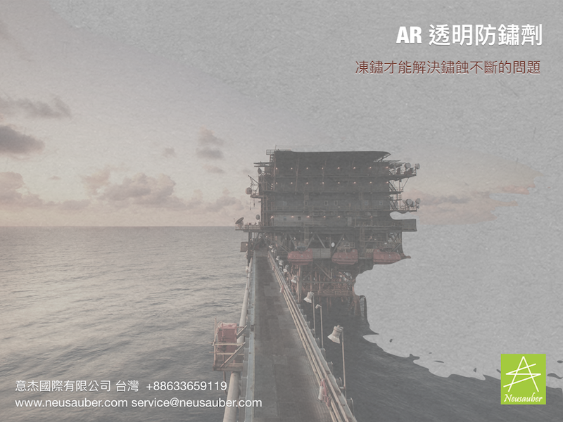
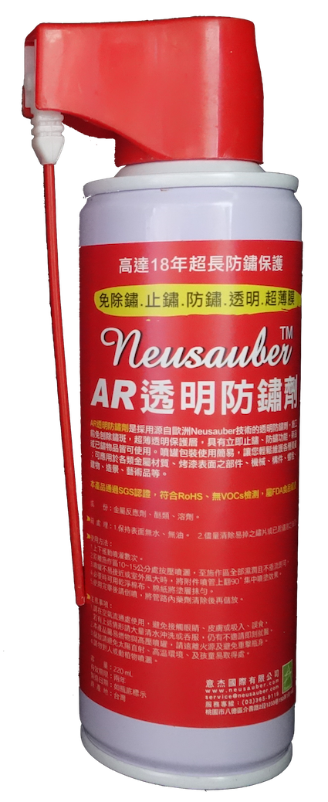
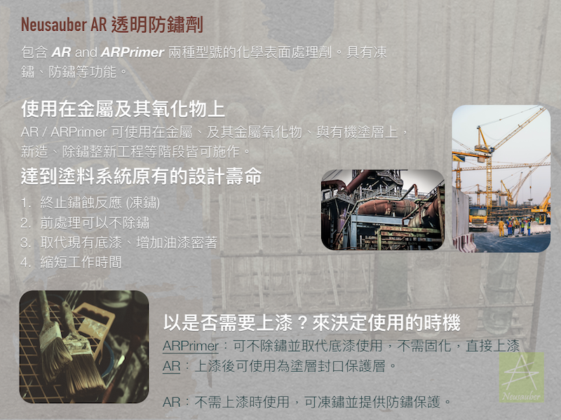
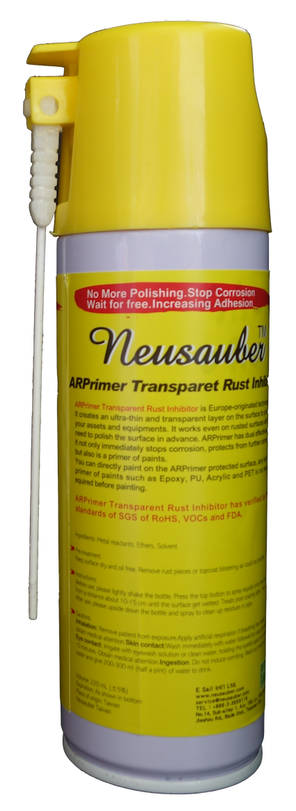

.. _h276045274242782117413577d31483a:

AR/ARPrimer 透明防鏽劑 - 防鏽 透明 免除鏽
*****************************************

|REPLACE1|

.. _h2c1d74277104e41780968148427e:

透過化學法將鏽蝕反應終止（凍鏽），可不除鏽施作，取代傳統各式底漆、增加密著、免固化時間縮短工期，或提供長效防鏽保護．適用新品、鏽蝕、或油漆表面，無論新造、維護保養、除鏽整新工程皆可使用，真正達成原有防鏽設計年限．產品符合現有國際環保規範與U.S. FDA認證．

非防鏽漆或防鏽油系統，高性能透明薄膜層，常用金屬材質皆可使用，長期防鏽蝕、防鹽害、防硫害、防沼氣最佳選擇．

詳細內容請至中文網站： \ |LINK1|\ 

.. _h2c1d74277104e41780968148427e:

.. _h6b417c78253075e44347e587a5f7f:

AR透明防鏽劑
============

+---------------------------------------------------------------------------------------------------------------------------------------------------------------------------------------+--------------+
|                                                                                                                                                                                       |  \ |IMG1|\   |
|                                                                                                                                                                                       |              |
|是採用源自歐洲Neusauber技術的透明防鏽劑，施工前免刨除鏽斑，超薄透明保護層不脫落，具有立即止鏽、防鏽功能，新品或已鏽物品皆可使用。使用簡易，讓您輕鬆維護各種資產。加強防鏽最高可達18年。|              |
|可應用於各類金屬材質、烤漆表面之部件，食品業器械、機械設備、構件、螺栓、建物、造景、藝術品等。海邊、溫泉區等嚴苛腐蝕環境皆可使用。                                                     |              |
|                                                                                                                                                                                       |              |
|適用溫度區間：+250 ~ -190℃                                                                                                                                                             |              |
|平均用量：200 m2 /加侖                                                                                                                                                                 |              |
|                                                                                                                                                                                       |              |
|包裝種類：1、5、20加侖桶                                                                                                                                                               |              |
|                                                                                                                                                                                       |              |
+---------------------------------------------------------------------------------------------------------------------------------------------------------------------------------------+--------------+

.. _h7e1865681f53284b2f86c6e3a681d7b:

AR透明防鏽劑 噴霧罐
===================

+------------------------------+---------------------+
|容量：220mL                   |          \ |IMG2|\  |
|                              |                     |
|使用面積：4 m\ |STYLE0|\   max|                     |
+------------------------------+---------------------+

.. _h77767b62302b382f512f69697c4c6862:

ARPrimer底塗型透明防鏽劑
========================

.. _h2c1d74277104e41780968148427e:

+-------------------------------------------------------------------------------------------------------------------------------------------------------------------------------------------------------------------------------------------+--------------+
|是採用源自歐洲Neusauber技術的透明防鏽劑，免除鏽即可施工，取代紅丹止鏽。ARPrimer的特別配方具備底漆功能，專為搭配面漆而設計，可增加面漆附著功能，取代各式面漆系統底漆．無論新品、鏽蝕舊品皆可使用，超薄透明膜層，讓您輕鬆維護珍貴資產與設備。|  \ |IMG3|\   |
|                                                                                                                                                                                                                                           |              |
|可應用於須上漆保護之各類金屬、烤漆表面部件，食品業器械、機械設備、構件、螺栓、建物等。海邊、溫泉區等嚴苛腐蝕環境皆可使用。                                                                                                                 |              |
|                                                                                                                                                                                                                                           |              |
|適用溫度區間：+250 ~ -190℃                                                                                                                                                                                                                 |              |
|                                                                                                                                                                                                                                           |              |
|平均用量：200 m\ |STYLE1|\  /加侖                                                                                                                                                                                                          |              |
|                                                                                                                                                                                                                                           |              |
|包裝種類：1、5、20加侖桶                                                                                                                                                                                                                   |              |
+-------------------------------------------------------------------------------------------------------------------------------------------------------------------------------------------------------------------------------------------+--------------+

.. _h2c1d74277104e41780968148427e:

.. _h62111e491b563fb6e65566a2346e6c:

ARPrimer底塗型透明防鏽劑 噴霧罐
===============================

+------------------------------+--------------------+
|容量：220mL                   |          \ |IMG4|\ |
|                              |                    |
|使用面積：4 m\ |STYLE2|\   max|                    |
+------------------------------+--------------------+

|REPLACE2|

|REPLACE3|

|REPLACE4|

 

|REPLACE5|

    更詳細資訊請聯絡 +886-3-3659119，由專人為您服務

.. bottom of content

.. |STYLE0| replace:: :sup:`2`

.. |STYLE1| replace:: :sup:`2`

.. |STYLE2| replace:: :sup:`2`

.. |REPLACE1| raw:: html

    
    
.. |REPLACE2| raw:: html

    
.. |REPLACE3| raw:: html

    
.. |REPLACE4| raw:: html

    <iframe id="video" width="560" height="315" src="https://youtu.be/74AgCrS-xtU" frameborder="0" gesture="media" allow="encrypted-media" allowfullscreen></iframe>
    
    
.. |REPLACE5| raw:: html

    <iframe id="video" width="560" height="315" src="https://www.youtube.com/embed/74AgCrS-xtU" frameborder="0" gesture="media" allow="encrypted-media" allowfullscreen></iframe>
    
    

.. |LINK1| raw:: html

    <a href="http://tw.neusauber.com" target="_blank">tw.neusauber.com</a>

