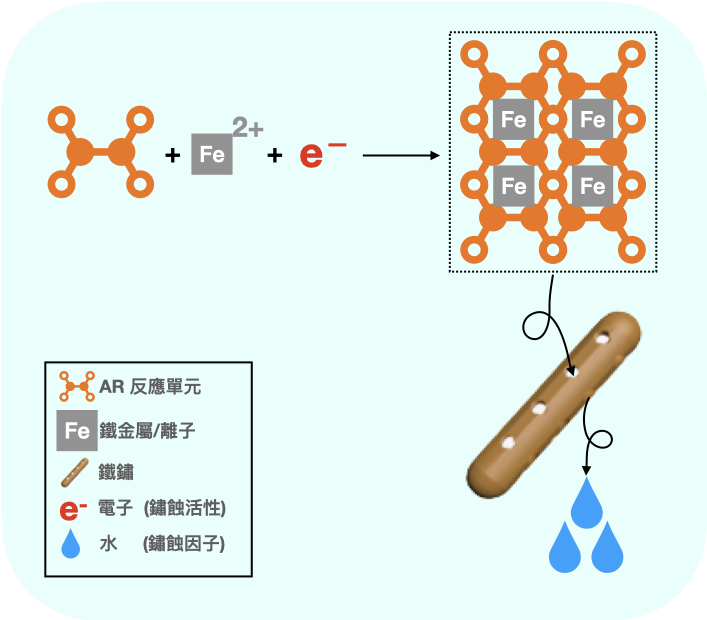
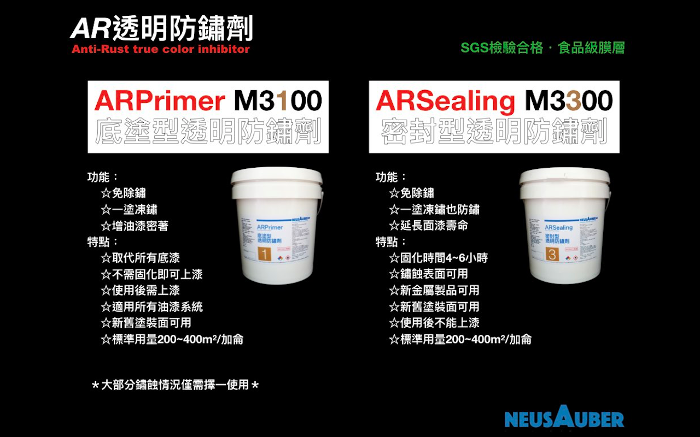
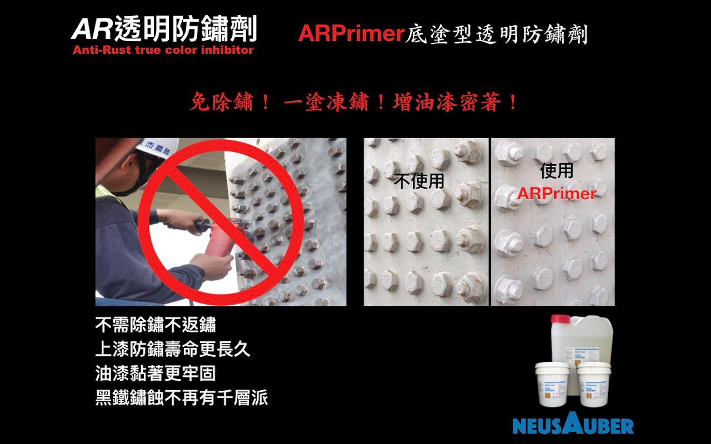
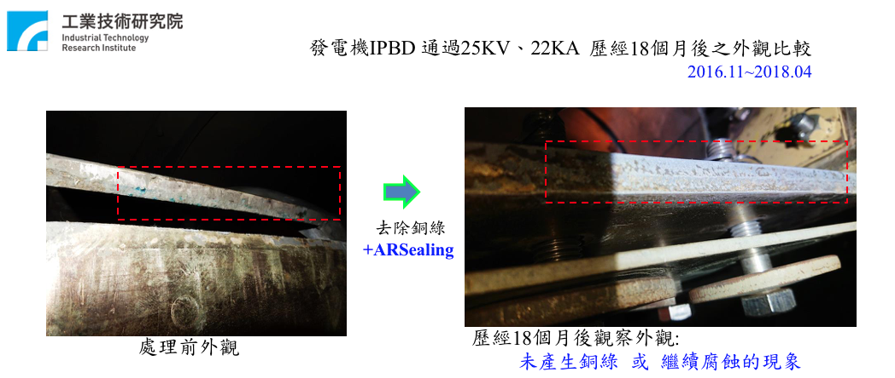

.. _h1f611a435e5b5c75605d4194d166e27:

ARSealing / ARPrimer 透明防鏽劑 - 防鏽透明免除鏽
************************************************

|REPLACE1|

.. _h2c1d74277104e41780968148427e:

.. _h46495d5c645e1b57c1c13254c55a1f:

詳細內容請至\ |LINK1|\ 
=======================

\ |STYLE0|\ 

\ |STYLE1|\ 

\ |STYLE2|\ 

.. admonition:: 獨家特色

    \ |STYLE3|\ 
    
    \ |STYLE4|\ 
    
    \ |STYLE5|\ 

.. _h2c1d74277104e41780968148427e:

.. _h174fb648377959437b5c1f697c1c40:

系列產品
========

\ |STYLE6|\ 

具有凍鏽、密著底漆功能之透明防鏽劑，可取代傳統所有底漆，如紅丹、合金底漆、鋅粉底漆、鏽轉化劑等，及提高面漆附著的功能。使用ARPrimer後不必等待固化，可直接施作所有種類面漆，達到凍鏽與防鏽功能。

\ |STYLE7|\ 

同時具有凍鏽及防鏽雙效功能，只要施作一道，不必搭配ARPrimer底塗使用，即可保留鏽蝕外觀又兼具防鏽效果。

.. admonition:: 產品說明表

    \ |IMG1|\ 

.. _h174fb648377959437b5c1f697c1c40:

防鏽能力
========

根據I\ |LINK2|\ 測試於海邊環境，使用ARSealing在已鏽蝕金屬，下一次修補時間可達2-5年。使用ARPrimer+Epoxy面漆在已鏽蝕金屬，下一次修補時間可達5-15年。

＊實際年限以各地區環境為準。

.. admonition:: ISO 12944 塗料系統選擇表

    \ |IMG2|\ 

.. _h174fb648377959437b5c1f697c1c40:

防護實例
========

.. _h1a304817295e107f71e7c225e3765e:

台灣高速公路遠通電收ETC電子收費設備門架防鏽改善工程
---------------------------------------------------

免除鏽之ARPrimer底塗凍鏽＋面漆保護工法，通過主管機關長期嚴格檢驗，效果遠優於先除鏽再使用鋅粉底漆的傳統方式，決定全線施作使用。

相較傳統工法，使用ARPrimer工法，在工時、人力、搭配設備上僅需原有的1/4，且無須交圍影響交通，除費用大幅減少、工期縮短、降低工安風險等，更延長維護週期，達到成本、施作效率及高品質三贏。

\ |IMG3|\ 

.. _h7517156d5a5676551327477832132226:

電廠發電機隔相匯流排導管(IPBD)防鏽
----------------------------------

高等級安全要求、長時不停機、海蝕環境，使得負載 550 MVA、表面溫度約200℃之大電流的電力傳輸設備，隔相匯流排導管(IPBD)深陷鏽蝕危機之中。工研院團隊評估除鏽後使用ARSealing來凍鏽與防鏽。ARSealing不影響表面導電性、凍結鏽蝕、停止鍍層鏽蝕剝落並全面防鏽，安全度過18個月歲修週期惡劣環境的挑戰，持續穩定輸出電力中。

\ |IMG4|\ 

.. admonition:: 購買聯絡資訊

    AR透明防鏽劑加侖桶包裝銷售、使用技術諮詢、大量用戶到府簡報，請聯絡
    
    意杰國際 03-3659119 葉先生
    service@neusauber.com
    
    AR透明防鏽劑噴罐指定代銷處：
    
    邦聖螺絲行 03-3358365  桃園市永安路277號

.. _h5e6d61421a7146385259747a2661225:

\ |LINK3|\ 
===========

(權利聲明：Neusauber、AR透明防鏽劑 為意杰國際註冊商標)

.. _h2c1d74277104e41780968148427e:

.. bottom of content

.. |STYLE0| replace:: **AR透明防鏽劑由意杰國際研發∙生產∙銷售。為淡黃色無黏度透明化學溶液，非油漆或鏽轉化劑系統。**

.. |STYLE1| replace:: **以獨家合成之強反應多官能基小分子化合物(PFRP, Polyfunctional Reactive Polymer)，滲入鏽蝕最底部搶先還原具反應性的被氧化金屬離子，凍結鏽蝕反應進行，該處將不再返鏽。**

.. |STYLE2| replace:: **經凍鏽後原鏽層即為附著極佳與覆蓋完整之最理想無機保護層，防護金屬避免再度氧化。施作簡單、快速，防鏽效果佳、壽命長。符合CNS4908、CNS4160標準。**

.. |STYLE3| replace:: **三大特點：免除鏽、施作快、不返鏽**

.. |STYLE4| replace:: **五種適用面：金屬面、鏽蝕面、油漆面、高熱面、低溫面**

.. |STYLE5| replace:: **七項優勢：用量省、免技巧、不挑漆、無膜厚、全透明、超環保、效果長**

.. |STYLE6| replace:: **ARPrimer底塗型透明防鏽劑**

.. |STYLE7| replace:: **ARSealing密封型透明防鏽劑**

.. |REPLACE1| raw:: html

    

.. |LINK1| raw:: html

    <a href="http://tw.neusauber.com" target="_blank">中文專用網站</a>

.. |LINK2| raw:: html

    <a href="http://tw.neusauber.com/zh_TW/latest/_images/Demo_2.png" target="_blank">SO12944標準</a>

.. |LINK3| raw:: html

    <a href="https://drive.google.com/open?id=1nHSIBiyQrueS9QiOmFhxDkDCfI8NeGzX" target="_blank">AR透明防鏽劑簡報下載</a>

