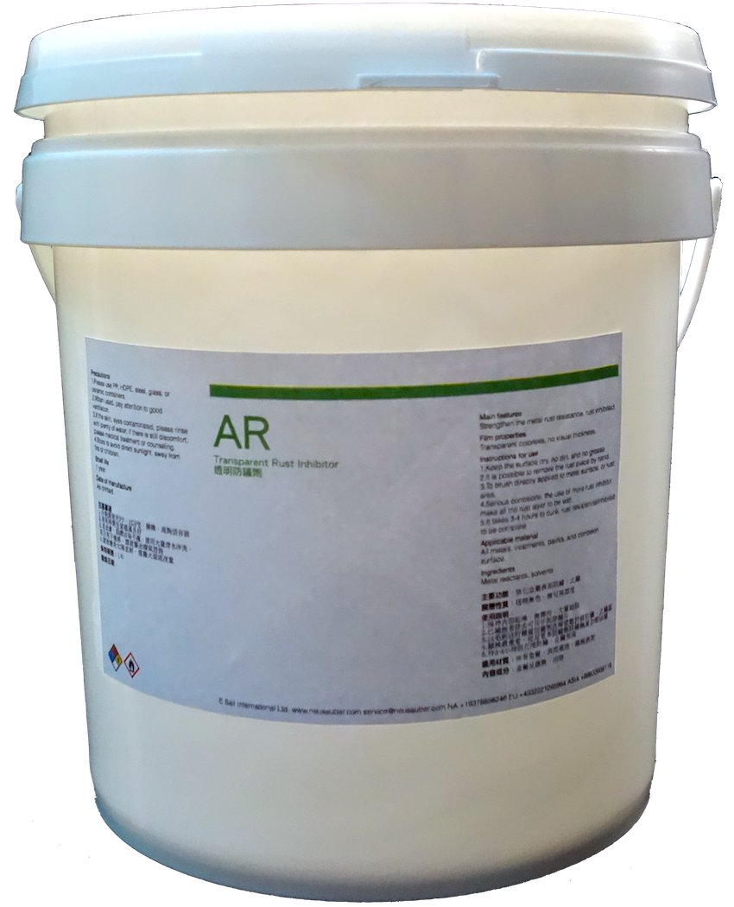
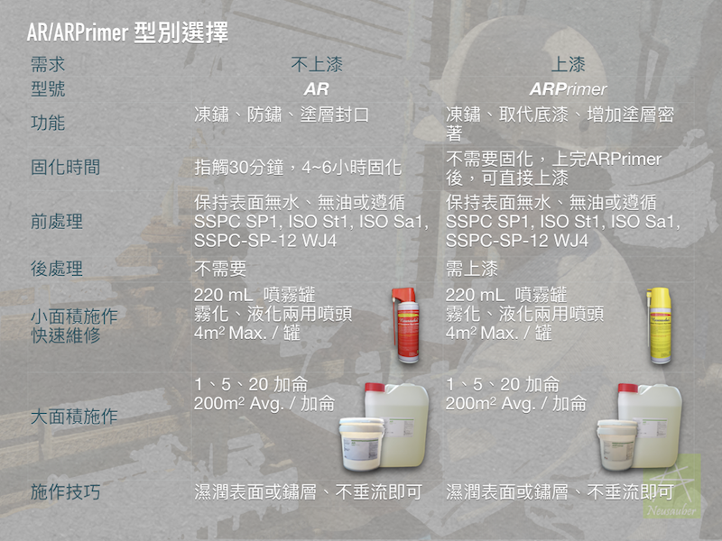

.. _h276045274242782117413577d31483a:

AR/ARPrimer 透明防鏽劑 - 防鏽 透明 免除鏽
*****************************************

|REPLACE1|

.. _h2c1d74277104e41780968148427e:

+----------+
|\ |IMG1|\ |
+----------+
|          |
+----------+

+----------+
|\ |IMG2|\ |
|          |
+----------+

    AR透明防鏽劑 溶劑型化學反應劑，具止鏽能力，並透過透明超薄膜層提供全方位防鏽保護，不論無鏽新品或生鏽表面皆可使用.防鏽能力於ISO 9223 C5等級海岸腐蝕環境可達2年半，一般自然環境高達7年.止鏽能力可將瑞典標準SIS-05-5900 等級D之鏽蝕，提升至等級Ａ

    SGS驗證符合Rohs, VOCs, FDA 標準

.. _h2c1d74277104e41780968148427e:

+----------------------------------+---+
|ARPrimer 底塗型透明防鏽劑         |   |
|                                  |   |
|全方位防鏽，適用任何金屬、漆面    |   |
|                                  |   |
|快速止鏽、免除鏽、施作快速        |   |
|                                  |   |
|防止腐蝕擴散                      |   |
|                                  |   |
|不用等待固化，立即可施作面漆      |   |
|                                  |   |
|取代合金底漆，提高漆面與金屬附著力|   |
|                                  |   |
|可刷塗、噴塗，無黏度，施作面積大  |   |
|                                  |   |
|適用各式面漆系統(如:Epoxy、PU等)  |   |
|                                  |   |
|節省工時，施工期短，期            |   |
|                                  |   |
|程容易安排                        |   |
|                                  |   |
|應用溫度範圍 -190 ~ +250 ℃        |   |
+----------------------------------+---+

    ARPrimer 底塗型透明防鏽劑 溶劑型化學反應劑，具止鏽能力，增加金屬與漆面附著力，適用各式面漆系統，如Epoxy、PU等可取代合金底漆. 施作後不需等待ARPrimer固化即可施作面漆，大幅縮短施工期程.不論無鏽新品或生鏽表面皆可使用.防鏽能力於ISO 9223 C5等級海岸腐蝕環境可達2年半，一般自然環境高達7年.止鏽能力可將瑞典標準SIS-05-5900 等級D之鏽蝕，提升至等級Ａ

    SGS驗證符合Rohs, VOCs, FDA 標準

    更詳細資訊請聯絡 +886-3-3659119，由專人為您服務

 

.. bottom of content

.. |REPLACE1| raw:: html

    
    

