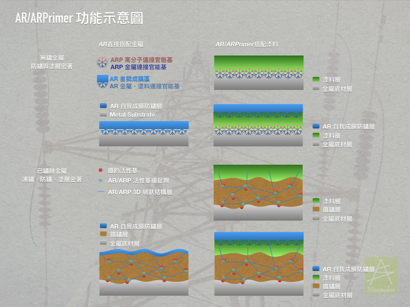
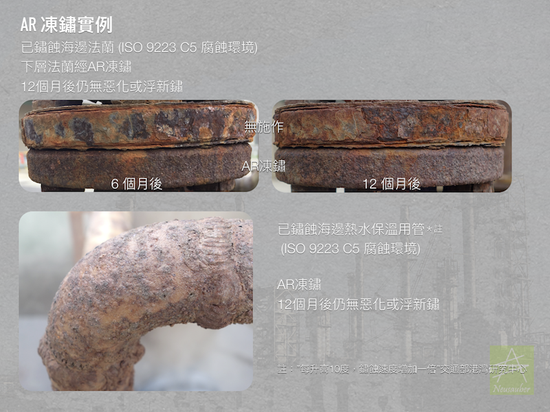
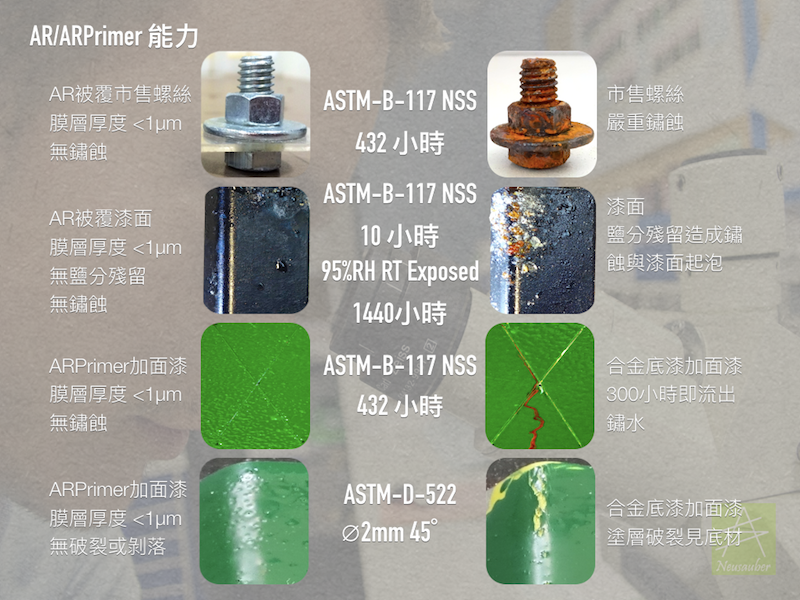
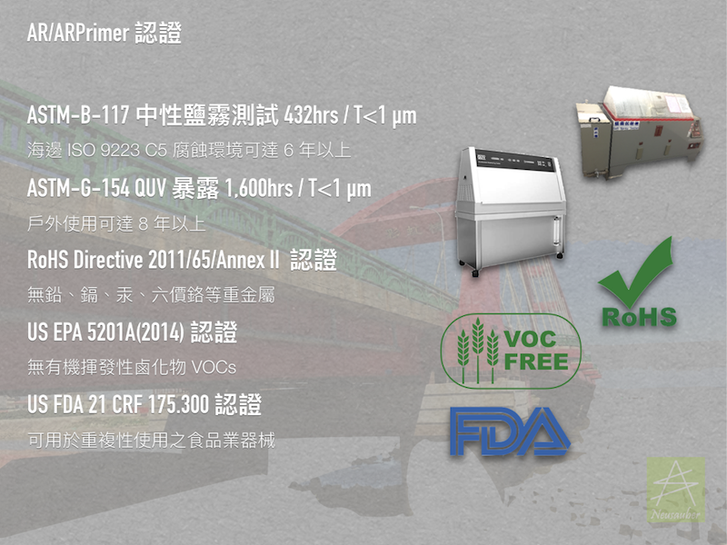
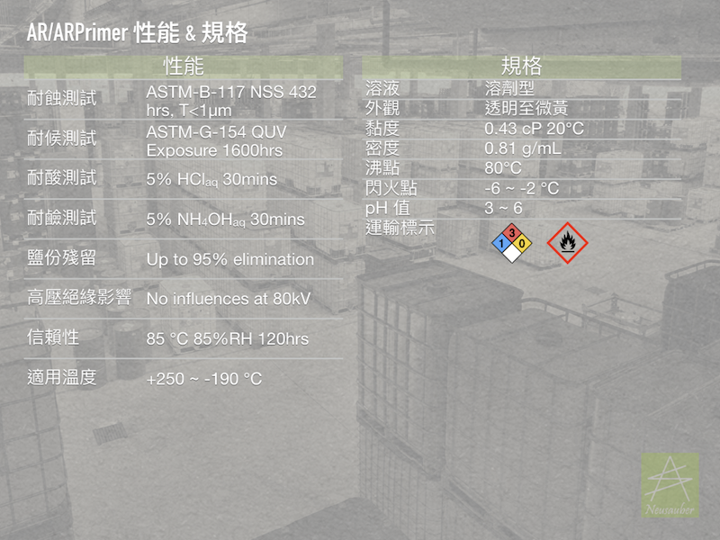

.. _h276045274242782117413577d31483a:

AR/ARPrimer 透明防鏽劑 - 防鏽 透明 免除鏽
*****************************************

|REPLACE1|

.. _h2c1d74277104e41780968148427e:

透過化學法將鏽蝕反應終止（凍鏽），可不除鏽施作，取代傳統各式底漆、增加密著、免固化時間縮短工期，或提供長效防鏽保護．適用新品、鏽蝕、或油漆表面，無論新造、維護保養、除鏽整新工程皆可使用，真正達成原有防鏽設計年限．產品符合現有國際環保規範與U.S. FDA認證．

非防鏽漆或防鏽油系統，高性能透明薄膜層，常用金屬材質皆可使用，長期防鏽蝕、防鹽害、防硫害、防沼氣最佳選擇．

詳細內容請至中文網站： \ |LINK1|\ 

\ |IMG1|\ 

\ |IMG2|\ 

\ |IMG3|\ 

\ |IMG4|\ 

\ |IMG5|\ 

\ |IMG6|\ 

\ |IMG7|\ 

\ |IMG8|\ 

\ |IMG9|\ 

|REPLACE2|

    更詳細資訊請聯絡 +886-3-3659119，由專人為您服務

 

.. bottom of content

.. |REPLACE1| raw:: html

    
    
.. |REPLACE2| raw:: html

    <iframe id="video" width="560" height="315" src="https://www.youtube.com/embed/bbC_PsDFVlQ" frameborder="0" gesture="media" allow="encrypted-media" allowfullscreen></iframe>
    
    

.. |LINK1| raw:: html

    <a href="http://tw.neusauber.com" target="_blank">tw.neusauber.com</a>

.. |IMG1| image:: static/影片_簡報圖片版_1.png
   :height: 524 px
   :width: 697 px

.. |IMG2| image:: static/影片_簡報圖片版_2.png
   :height: 524 px
   :width: 697 px

.. |IMG3| image:: static/影片_簡報圖片版_3.png
   :height: 524 px
   :width: 697 px

.. |IMG4| image:: static/影片_簡報圖片版_4.png
   :height: 524 px
   :width: 697 px

