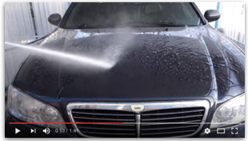
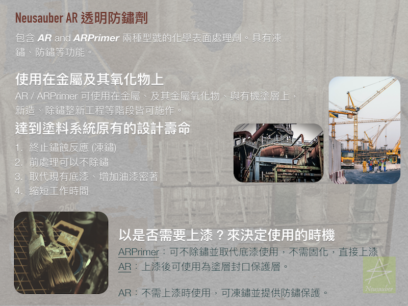

.. _h1634483c7822441972316c7301545:

影片
****

.. _h7f1177347d4616613e2a2e244965353d:

AR600施工抽水馬達
=================

本影片用鏽蝕極度嚴重的抽水馬達，展示AR600的防鏽能力。

\ |IMG1|\ 

.. _h364e3b5a2744244841154a7d3c7d4a7f:

AR600縮時攝影
=============

本影片將一段金屬材料分成左右兩組，以縮時攝影互相對照的方式展示AR600優越能力。

\ |IMG2|\ 

.. _ha510775e59102ce19203855203711:

SV500施工汽車
=============

本影片為SV500G在汽車玻璃及車身使用前後的錄影，展示SV500的優異特性。

\ |IMG3|\ 

.. _h174fb648377959437b5c1f697c1c40:

塗抹技巧
========

本影片說明塗抹SV600時的技巧。

\ |IMG4|\ 

.. bottom of content

.. |IMG1| image:: static/videos_1.png
   :height: 174 px
   :width: 302 px
   :target: https://www.youtube.com/watch?v=eIx9JPzWINQ

.. |IMG2| image:: static/videos_2.png
   :height: 174 px
   :width: 306 px
   :target: https://www.youtube.com/watch?v=7Ji7zLe8bHU

