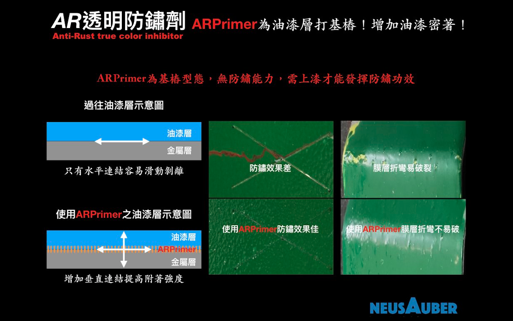

.. _h1f611a435e5b5c75605d4194d166e27:

ARSealing / ARPrimer 透明防鏽劑 - 防鏽透明免除鏽
************************************************

|REPLACE1|

.. _h2c1d74277104e41780968148427e:

.. _h46495d5c645e1b57c1c13254c55a1f:

詳細內容請至\ |LINK1|\ 
=======================

\ |STYLE0|\ 

\ |STYLE1|\ 

\ |STYLE2|\ 

\ |STYLE3|\ 

\ |STYLE4|\ 

\ |STYLE5|\ 

\ |STYLE6|\ 

.. admonition:: ”凍鏽“是什麼？

    \ |IMG1|\ 

AR反應單元可將游離鐵離子與鏽蝕活性鎖住，固定於鏽結構內的空孔，原本孔內的鏽蝕因子－水，則被會擠出。

\ |STYLE7|\ 。

.. _h2c1d74277104e41780968148427e:

.. _h174fb648377959437b5c1f697c1c40:

系列產品
========

.. admonition:: 產品列表

    \ |IMG2|\ 

\ |STYLE8|\ 

具有凍鏽、密著底漆功能之透明防鏽劑，可取代傳統所有底漆，如紅丹、合金底漆、鋅粉底漆、鏽轉化劑等，及提高面漆附著的功能。使用ARPrimer後不必等待固化，可直接施作所有種類面漆，達到凍鏽與防鏽功能。

.. admonition:: ARPrimer

    \ |IMG3|\ \ |IMG4|\ 

\ |STYLE9|\ 

同時具有凍鏽又防鏽雙效功能，只要施作一道，不必搭配ARPrimer底塗使用，即可保留鏽蝕外觀又兼具防鏽效果。

.. admonition:: ARSealing

    \ |IMG5|\ \ |IMG6|\ 

.. _h174fb648377959437b5c1f697c1c40:

使用方式
========

.. admonition:: 使用方式

    \ |IMG7|\ \ |IMG8|\ 

.. _h174fb648377959437b5c1f697c1c40:

防鏽能力
========

根據I\ |LINK2|\ 測試於海邊環境，使用ARSealing在已鏽蝕金屬，下一次修補時間可達2-5年。使用ARPrimer+Epoxy面漆在已鏽蝕金屬，下一次修補時間可達5-15年。

.. admonition:: 可依環境與需求選擇對應防鏽工法

    \ |IMG9|\ 

＊實際年限以各地區環境為準。

.. _h174fb648377959437b5c1f697c1c40:

案例分析
========

.. admonition:: 高速公路工程案例

    \ |IMG10|\ 

.. _h365425373c54557813239715c73338:

AR透明防鏽劑防護中
==================

.. admonition:: 知名案例

    \ |IMG11|\ 

.. admonition:: 購買聯絡資訊

    AR透明防鏽劑加侖桶包裝銷售、使用諮詢，請聯絡
    
    意杰國際 03-3659119 葉先生
    \ |LINK3|\ 
    Line ID:@345rxpyp\ |IMG12|\ 

.. admonition:: 噴漆罐包裝全台指定代銷處

    抱歉！噴罐缺貨中......
    
    
    邦聖螺絲行 03-3358365  桃園市永安路277號（外縣市可代安排寄送）

.. _h6f15a413cb3d267b3e4f1c74347521:

\ |LINK4|\ 
===========

(權利聲明：Neusauber、AR透明防鏽劑 為意杰國際註冊商標)

|REPLACE2|

.. bottom of content

.. |STYLE0| replace:: **AR透明防鏽劑為溶劑型淡黃色無黏度透明化學溶液，滲透性、擴展性極佳，專門針對室內外既有金屬設施之前處理或表面處理劑。不需要除鏽即可終止鏽蝕活性、或提供長效防鏽、增加各式塗層密著與其壽命之功能。非油漆、油脂或鏽轉化劑系統。**

.. |STYLE1| replace:: **以獨家凍鏽技術，滲入鏽蝕最底部主動結合具反應活性的金屬離子，隨即終結與凍結鏽蝕反應，該處將不再持續鏽蝕，達到極佳防鏽效果。**

.. |STYLE2| replace:: **經凍鏽後原鏽層即為高硬度、附著極佳與覆蓋完整之最理想無機保護層，防護金屬避免再度氧化。**

.. |STYLE3| replace:: **施作簡單、快速，防鏽效果佳、壽命長。工研院與SGS檢測，材料安全環保，同時符合CNS4908、與CNS4160標準，更通過美國FDA食品級塗層認證。**

.. |STYLE4| replace:: **AR透明防鏽劑有可於塗裝前、塗裝間使用的ARPrimer 底塗型透明防鏽劑。塗裝前使用提供凍鏽及增加塗料密著功能，塗裝間使用提供塗料密著功能。建議ARPrimer與塗料噴塗一前一後雙工同時施作，可發揮最大防鏽或塗料密著功效。**

.. |STYLE5| replace:: **AR透明防鏽劑也有不需後塗裝或塗裝後使用的ARSealing 密封型透明防鏽劑。直接使用不需後塗裝，即可同時提供凍鏽、防鏽雙效功能。塗裝後使用可提供塗層耐UV抗粉化、提高防鏽壽命等功能。.**

.. |STYLE6| replace:: **橋樑、建築、動力車輛/底盤、機械設備、太陽能、風力發電、化學管線/槽/架、室內物品、食品設備、自行車等防鏽，所有室內、室外、高鹽害、高磺害之金屬設施或設備都適用，無法除鏽、除鏽困難區域更合適。鐵材、鋼材、鋼纜、銅製、鋁製、鎳鍍層、鋅鍍層、油漆層皆可用。**

.. |STYLE7| replace:: **經AR凍鏽後不僅無需除鏽，且防鏽能力至少提高兩倍以上**

.. |STYLE8| replace:: **ARPrimer底塗型透明防鏽劑**

.. |STYLE9| replace:: **ARSealing密封型透明防鏽劑**

.. |REPLACE1| raw:: html

    
.. |REPLACE2| raw:: html

    

.. |LINK1| raw:: html

    <a href="http://tw.neusauber.com" target="_blank">中文專用網站</a>

.. |LINK2| raw:: html

    <a href="http://tw.neusauber.com/zh_TW/latest/_images/Demo_2.png" target="_blank">SO12944標準</a>

.. |LINK3| raw:: html

    <a href="mailto:service@neusauber.com">service@neusauber.com</a>

.. |LINK4| raw:: html

    <a href="https://drive.google.com/file/d/1adyVc2g4U2l5Ed1Vgx4rSlCHIgkNhV0H/view?usp=sharing" target="_blank">AR透明防鏽劑簡報下載</a>

.. |IMG1| image:: static/影片_1.png
   :height: 598 px
   :width: 682 px

.. |IMG6| image:: static/影片_6.png
   :height: 426 px
   :width: 682 px

.. |IMG7| image:: static/影片_7.png
   :height: 426 px
   :width: 682 px

.. |IMG12| image:: static/影片_12.png
   :height: 197 px
   :width: 197 px
