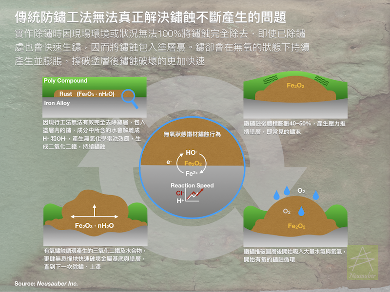

.. _h3c3227c6b5e1a45d1860682375c11:

AR/ARPrimer 透明防鏽劑
**********************

|REPLACE1|

.. _h2c1d74277104e41780968148427e:

|REPLACE2|

    AR透明防鏽劑 溶劑型化學反應劑，具止鏽能力，並透過透明超薄膜層提供全方位防鏽保護，不論無鏽新品或生鏽表面皆可使用.防鏽能力於ISO 9223 C5等級海岸腐蝕環境可達2年半，一般自然環境高達7年.止鏽能力可將瑞典標準SIS-05-5900 等級D之鏽蝕，提升至等級Ａ

    SGS驗證符合Rohs, VOCs, FDA 標準

.. _h2c1d74277104e41780968148427e:

|REPLACE3|

    ARPrimer 底塗型透明防鏽劑 溶劑型化學反應劑，具止鏽能力，增加金屬與漆面附著力，適用各式面漆系統，如Epoxy、PU等可取代合金底漆. 施作後不需等待ARPrimer固化即可施作面漆，大幅縮短施工期程.不論無鏽新品或生鏽表面皆可使用.防鏽能力於ISO 9223 C5等級海岸腐蝕環境可達2年半，一般自然環境高達7年.止鏽能力可將瑞典標準SIS-05-5900 等級D之鏽蝕，提升至等級Ａ

    SGS驗證符合Rohs, VOCs, FDA 標準

    更詳細資訊請聯絡 +886-3-3659119，由專人為您服務

 

.. bottom of content

.. |REPLACE1| raw:: html

    
.. |REPLACE2| raw:: html

    <table cellspacing="0" cellpadding="0" style="width:100%">
    <tbody>
    <tr><td style="width:53%;vertical-align:Top;padding-top:5px;padding-bottom:5px;padding-left:5px;padding-right:5px;border:solid 1px #000000">
AR 透明防鏽劑
<ul style="list-style:disc;list-style-image:inherit;padding:0px 40px;margin:initial"><li style="list-style:inherit;list-style-image:inherit">全方位防鏽，適用任何金屬、漆面</li><li style="list-style:inherit;list-style-image:inherit">快速止鏽、免除鏽、施作快速</li><li style="list-style:inherit;list-style-image:inherit">透明超薄膜保護層，延長金屬、漆面使用壽命</li><li style="list-style:inherit;list-style-image:inherit">可刷塗、噴塗，無黏度，施作面積大</li><li style="list-style:inherit;list-style-image:inherit">節省工時，施工期短，期程容易安排</li><li style="list-style:inherit;list-style-image:inherit">應用溫度範圍 -50 ~ +150 ℃</li></ul>
</td><td style="width:47%;vertical-align:Top;padding-top:5px;padding-bottom:5px;padding-left:5px;padding-right:5px;border:solid 1px #000000">

</td></tr>
    </tbody></table>

.. |REPLACE3| raw:: html

    <table cellspacing="0" cellpadding="0" style="width:100%">
    <tbody>
    <tr><td style="width:54%;vertical-align:Top;padding-top:5px;padding-bottom:5px;padding-left:5px;padding-right:5px;border:solid 1px #000000">
ARPrimer 底塗型透明防鏽劑
<ul style="list-style:disc;list-style-image:inherit;padding:0px 40px;margin:initial"><li style="list-style:inherit;list-style-image:inherit">全方位防鏽，適用任何金屬、漆面</li><li style="list-style:inherit;list-style-image:inherit">快速止鏽、免除鏽、施作快速</li><li style="list-style:inherit;list-style-image:inherit">防止腐蝕擴散</li><li style="list-style:inherit;list-style-image:inherit">不用等待固化，立即可施作面漆</li><li style="list-style:inherit;list-style-image:inherit">取代合金底漆，提高漆面與金屬附著力</li><li style="list-style:inherit;list-style-image:inherit">可刷塗、噴塗，無黏度，施作面積大</li><li style="list-style:inherit;list-style-image:inherit">適用各式面漆系統(如:Epoxy、PU等)</li><li style="list-style:inherit;list-style-image:inherit">節省工時，施工期短，期程容易安排</li><li style="list-style:inherit;list-style-image:inherit">應用溫度範圍 -50 ~ +150 ℃</li></ul>
</td><td style="width:46%;vertical-align:Top;padding-top:5px;padding-bottom:5px;padding-left:5px;padding-right:5px;border:solid 1px #000000">

</td></tr>
    </tbody></table>

.. |IMG1| image:: static/videos_1.png
   :height: 238 px
   :width: 193 px

